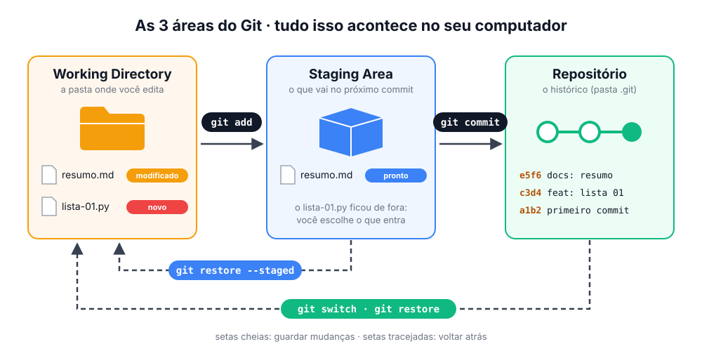
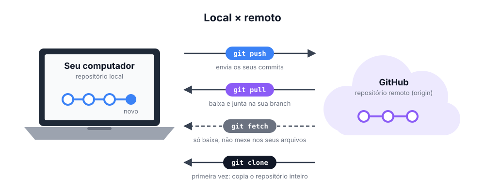

# 🌱 Git

> [← voltar para Conteúdo](../README.md)

**Nível:** 🟢 Iniciante

## Trilha de leitura

| # | Arquivo | Nível | Você vai aprender |
| - | ------- | ----- | ----------------- |
| 1 | **Este arquivo** | 🟢 Iniciante | O que é o Git e como ele funciona |
| 2 | [Comandos](comandos.md) | 🟢 Iniciante | Os comandos do dia a dia |
| 3 | [Branches](branches.md) | 🟡 Intermediário | Branches, merge e conflitos |
| 4 | [Desfazer coisas](desfazer.md) | 🔴 Avançado | Como sair de enrascadas |

---

## O que é o Git?

O Git é um **sistema de controle de versão**: ele guarda o **histórico** de tudo que muda nos seus arquivos.

Com ele você pode:

- 🕐 **Voltar no tempo** para qualquer versão anterior.
- 🌿 **Testar ideias** em paralelo, sem estragar o que já funciona.
- 👥 **Trabalhar em grupo** sem um sobrescrever o trabalho do outro.

> **Git ≠ GitHub.** O **Git** é o programa que roda no seu computador. O **GitHub** é um site que guarda uma cópia do seu repositório na nuvem.

## As 3 áreas do Git

Todo arquivo passa por três lugares **no seu computador**:

| Área | O que é | Analogia |
| ---- | ------- | -------- |
| **Working Directory** | Seus arquivos, do jeito que estão agora | A mesa onde você trabalha |
| **Staging Area** | O que você separou para salvar | A caixa que você está montando |
| **Repositório** | O histórico de todos os commits | A caixa lacrada e etiquetada na estante |

## Local × remoto

- `git push` **envia** os seus commits para o GitHub.
- `git pull` **traz** os commits dos outros e junta na sua branch.
- `git fetch` só **baixa**, sem mexer nos seus arquivos.
- `git clone` **copia** o repositório inteiro, na primeira vez.
- `origin` é o nome padrão do repositório remoto.

## Glossário rápido

| Termo | Em uma frase |
| ----- | ------------ |
| **Repositório (repo)** | Pasta cujo histórico é controlado pelo Git |
| **Commit** | Uma "foto" dos arquivos em um momento, com uma mensagem |
| **Branch** | Uma linha de trabalho paralela |
| **`main`** | A branch principal |
| **Merge** | Juntar uma branch em outra |
| **Conflito** | Quando duas pessoas mudam a mesma linha e o Git não sabe qual manter |
| **Clone** | Baixar um repositório remoto pela primeira vez |
| **Pull Request (PR)** | Pedido, no GitHub, para juntar sua branch na `main` |
| **HEAD** | Onde você está agora (o commit ou branch atual) |

## 📚 Referências

- [Pro Git (livro oficial e gratuito, em português)](https://git-scm.com/book/pt-br/v2)
- [Learn Git Branching (tutorial interativo e visual, em português)](https://learngitbranching.js.org/?locale=pt_BR)
- [GitHub Docs: Sobre o Git](https://docs.github.com/pt/get-started/using-git/about-git)
- [Git Cheat Sheet do GitHub (PDF)](https://education.github.com/git-cheat-sheet-education.pdf)
- [Documentação oficial dos comandos](https://git-scm.com/docs)
