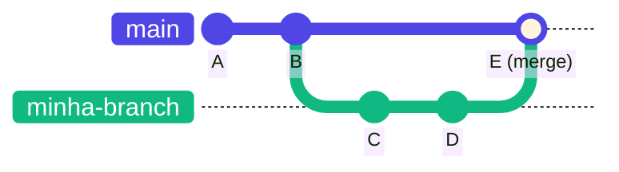
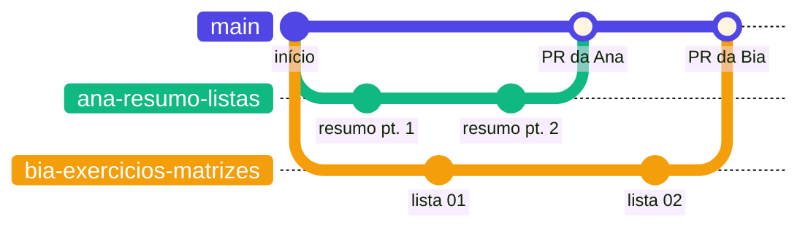
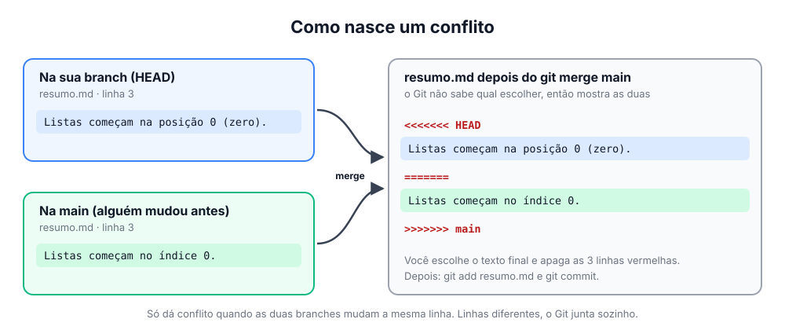

# 🌿 Branches, merge e conflitos

> [← voltar para Git](README.md)

**Nível:** 🟡 Intermediário

## O que é uma branch?

Uma **branch** é uma linha de trabalho paralela. Você cria uma, faz suas mudanças nela, e a `main` continua intacta até você juntar as duas.



- `A` e `B` já estavam na `main`.
- Você criou a `minha-branch` e fez `C` e `D`. Enquanto isso, a `main` ficou intacta.
- O merge juntou tudo de volta na `main`, no commit `E`.

### Várias pessoas ao mesmo tempo

É assim que um grupo trabalha junto: cada pessoa na sua branch, e cada uma entra na `main` pelo seu Pull Request.



## Por que usar?

- ✅ A `main` sempre fica funcionando.
- ✅ Cada pessoa trabalha na sua branch, sem atrapalhar ninguém.
- ✅ Dá para abrir um **Pull Request** e alguém revisar antes do merge.

## Na prática

```bash
git switch main
git pull                      # parte da main atualizada
git switch -c minha-branch    # cria a branch e entra nela
# ... commits ...
git push -u origin HEAD       # envia; depois abra o PR no GitHub
```

Neste repositório, o merge acontece pelo **Pull Request** no GitHub (veja o [passo 10 do Guia de Acesso](../../GUIA-DE-ACESSO.md#10-abrir-um-pull-request)).

## Conflitos

Um **conflito** acontece quando duas branches mudam **a mesma linha** do mesmo arquivo. O Git não sabe qual versão manter e pede para você escolher.



Em texto puro, o arquivo fica assim:

```text
<<<<<<< HEAD
Texto que está na SUA branch
=======
Texto que veio da OUTRA branch
>>>>>>> main
```

### Como resolver

1. Rode `git status` para ver quais arquivos estão em conflito.
2. Abra o arquivo e **escolha** o texto final: uma das versões, as duas ou uma mistura.
3. **Apague** as marcações `<<<<<<<`, `=======` e `>>>>>>>`.
4. Salve e finalize:

```bash
git add arquivo.md
git commit            # finaliza o merge
```

> 💡 O **VS Code** mostra botões como *Accept Current*, *Accept Incoming* e *Accept Both* em cima de cada conflito. Ajuda muito.

Quer desistir do merge no meio? Use `git merge --abort` e tudo volta ao que era antes.

## Como evitar conflitos

- Rode `git pull` **sempre** antes de começar.
- Faça branches **curtas**: merge rápido, de preferência em poucos dias.
- Combine com o grupo quem vai mexer em qual arquivo.

## 📚 Referências

- [Learn Git Branching (tutorial interativo, em português)](https://learngitbranching.js.org/?locale=pt_BR)
- [Pro Git: Branches no Git](https://git-scm.com/book/pt-br/v2/Ramifica%c3%a7%c3%a3o-Branching-no-Git-Branches-em-Poucas-Palavras)
- [GitHub Docs: Resolver conflitos de merge](https://docs.github.com/pt/pull-requests/collaborating-with-pull-requests/addressing-merge-conflicts/resolving-a-merge-conflict-using-the-command-line)
