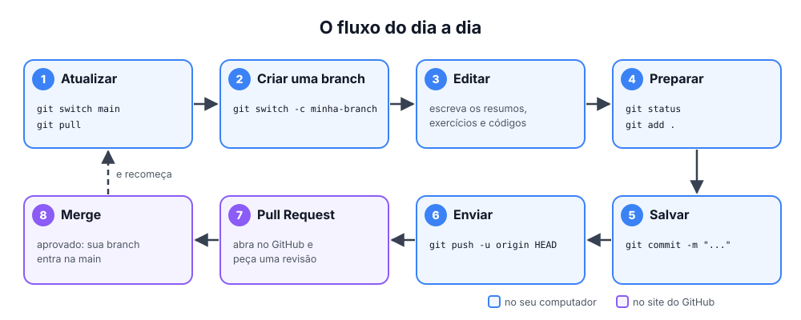

# ⌨️ Comandos do dia a dia

> [← voltar para Git](README.md)

**Nível:** 🟢 Iniciante

## Configuração (uma vez só)

| Comando | O que faz |
| ------- | --------- |
| `git config --global user.name "Seu Nome"` | Define seu nome em todos os repos |
| `git config --global user.email "voce@email.com"` | Define seu e-mail em todos os repos |
| `git config user.email "voce@exemplo.com"` | Igual ao anterior, mas **só no repo atual** |
| `git config --list` | Mostra todas as configurações |

## Começar

| Comando | O que faz |
| ------- | --------- |
| `git clone <url>` | Baixa um repositório do GitHub |
| `git init` | Transforma a pasta atual em um repositório Git |

## Salvar mudanças

| Comando | O que faz |
| ------- | --------- |
| `git status` | Mostra o que mudou. **Use sempre!** |
| `git add arquivo.md` | Coloca um arquivo na staging area |
| `git add .` | Coloca **tudo** da pasta atual na staging area |
| `git commit -m "mensagem"` | Salva o que está na staging area no histórico |
| `git diff` | Mostra o que mudou e **ainda não** foi para o `add` |
| `git diff --staged` | Mostra o que já foi para o `add` e vai entrar no próximo commit |

## Sincronizar com o GitHub

| Comando | O que faz |
| ------- | --------- |
| `git pull` | Traz as novidades do GitHub e junta na sua branch |
| `git push` | Envia seus commits para o GitHub |
| `git push -u origin HEAD` | Envia uma branch nova pela primeira vez |
| `git fetch` | Baixa as novidades, mas **não** junta na sua branch |

## Ver o histórico

| Comando | O que faz |
| ------- | --------- |
| `git log --oneline` | Lista os commits, um por linha |
| `git log --oneline --graph --all` | Mostra o histórico em forma de árvore |
| `git show <commit>` | Mostra o que mudou em um commit |
| `git blame arquivo.md` | Mostra quem mudou cada linha do arquivo |

## Branches

| Comando | O que faz |
| ------- | --------- |
| `git branch` | Lista as branches locais |
| `git switch -c nome` | Cria uma branch e já entra nela |
| `git switch nome` | Troca de branch |
| `git merge nome` | Junta a branch `nome` na branch atual |
| `git branch -d nome` | Apaga uma branch que já foi mergeada |

➡️ Mais detalhes em [Branches](branches.md).

## Exemplo completo



```bash
git switch main && git pull              # 1. parte da main atualizada
git switch -c resumo/git-branches          # 2. cria sua branch
# ... edita os arquivos ...
git status                               # 3. confere o que mudou
git add conteudo/git/                    # 4. separa as mudanças
git commit -m "docs(git): resumo de branches"   # 5. salva
git push -u origin HEAD                  # 6. envia e abre o PR no GitHub
```

## 💡 Dicas

- Rode `git status` **antes e depois** de cada comando. Ele diz o que está acontecendo e, muitas vezes, qual comando usar em seguida.
- Faça **commits pequenos**, com uma ideia cada. Fica mais fácil de revisar e de desfazer.
- **Sempre** rode `git pull` antes de começar a trabalhar.
- Qualquer comando aceita `--help`, por exemplo `git commit --help`.

## 📚 Referências

- [Pro Git: Obtendo um repositório Git](https://git-scm.com/book/pt-br/v2/Fundamentos-do-Git-Obtendo-um-Reposit%c3%b3rio-Git)
- [Git Cheat Sheet do GitHub (PDF)](https://education.github.com/git-cheat-sheet-education.pdf)
- [Conventional Commits (padrão de mensagens de commit)](https://www.conventionalcommits.org/pt-br/v1.0.0/)
- [Documentação oficial dos comandos](https://git-scm.com/docs)
