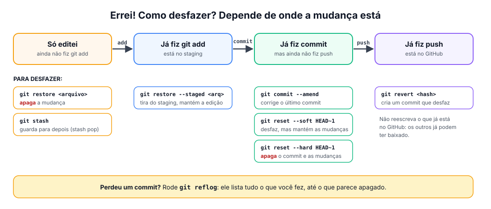

# ↩️ Desfazer coisas

> [← voltar para Git](README.md)

**Nível:** 🔴 Avançado

Errou? Calma: no Git, **quase tudo tem volta**. Encontre a sua situação na lista abaixo.



> ⚠️ Comandos marcados com 🔥 **apagam trabalho** que não foi salvo em commit. Leia duas vezes antes de rodar.

## Antes do commit

| Situação | Comando |
| -------- | ------- |
| Fiz `git add` em um arquivo que não queria | `git restore --staged arquivo.md` |
| Quero descartar as mudanças de um arquivo 🔥 | `git restore arquivo.md` |
| Quero descartar **todas** as mudanças 🔥 | `git restore .` |
| Quero guardar as mudanças para depois | `git stash` (e depois `git stash pop` para trazer de volta) |

## Depois do commit (antes do push)

| Situação | Comando |
| -------- | ------- |
| Errei a mensagem do último commit | `git commit --amend -m "nova mensagem"` |
| Esqueci um arquivo no último commit | `git add arquivo.md` e depois `git commit --amend --no-edit` |
| Quero desfazer o último commit, **mantendo** as mudanças | `git reset --soft HEAD~1` |
| Quero apagar o último commit **e** as mudanças 🔥 | `git reset --hard HEAD~1` |
| Fiz commit na `main` sem querer | Veja o passo a passo abaixo ⬇️ |

### Fiz commit na `main` sem querer

```bash
git switch -c minha-branch   # cria uma branch com o seu commit
git switch main
git reset --hard origin/main # 🔥 volta a main para o que está no GitHub
git switch minha-branch      # continue o trabalho aqui
```

## Depois do push

Não reescreva o histórico que já está no GitHub. Em vez disso, **crie um commit que desfaz** o anterior:

```bash
git revert <hash-do-commit>
git push
```

> Use `git log --oneline` para descobrir o `<hash-do-commit>` (o código curto, como `486dddc`).

## "Perdi um commit!" 😱

O Git guarda por um tempo tudo o que você fez, **inclusive o que parece apagado**:

```bash
git reflog                  # lista tudo o que o HEAD já foi
git switch -c resgate <hash> # cria uma branch no commit perdido
```

## 📚 Referências

- [Oh Shit, Git!?! (soluções para enrascadas comuns)](https://ohshitgit.com/pt_BR)
- [Pro Git: Desfazendo coisas](https://git-scm.com/book/pt-br/v2/Fundamentos-do-Git-Desfazendo-Coisas)
- [GitHub Blog: How to undo (almost) anything with Git (em inglês)](https://github.blog/open-source/git/how-to-undo-almost-anything-with-git/)
