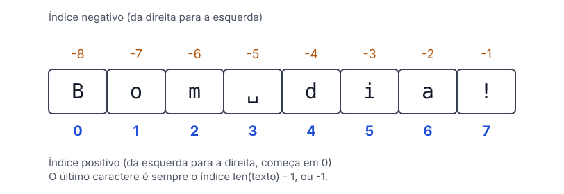

# 🔤 Strings

> [← Matrizes](03-matrizes.md) · [Voltar para Python](../README.md)

**Nível:** 🟢 Iniciante

Uma **string** é um texto: uma sequência de caracteres entre aspas. Ela se parece muito com uma lista, mas tem dois conceitos importantes:

| Conceito | O que significa |
| -------- | --------------- |
| **Índices** | Cada caractere tem uma posição (começa em 0) |
| **Imutabilidade** | Uma string **não pode ser modificada** depois de criada |

```python
frase = "Bom dia!"
vazia = ""
```

## Índices



- A contagem vai da esquerda para a direita e **começa em 0**.
- A última posição é `len(texto) - 1`.
- Índices **negativos** contam de trás para frente: `-1` é o último caractere.

| Código | Resultado | O que faz |
| ------ | --------- | --------- |
| `frase[0]` | `"B"` | Primeiro caractere |
| `frase[-1]` | `"!"` | Último caractere |
| `frase[0:3]` | `"Bom"` | Fatia do índice 0 **até** o 3 (o 3 não entra) |
| `frase[:3]` | `"Bom"` | Do começo até o 3 |
| `frase[4:]` | `"dia!"` | Do índice 4 até o fim |
| `frase[::-1]` | `"!aid moB"` | Texto invertido |

## Imutabilidade

Não dá para trocar um caractere no lugar. Os métodos de texto **devolvem uma string nova** e deixam a original como está:

```python
frase = "Bom dia!"
frase[0] = "T"                  # TypeError: 'str' object does not support item assignment

frase.replace("Bom", "Boa")     # a troca é feita, mas ninguém guardou o resultado
print(frase)                    # Bom dia!

nova = frase.replace("Bom", "Boa")
print(nova)                     # Boa dia!
```

> ⚠️ **Cuidado:** `frase.upper()` sozinho não muda `frase`. Guarde o resultado: `frase = frase.upper()`.

## Tamanho e busca

| Código | Resultado | O que faz |
| ------ | --------- | --------- |
| `len("Bom dia!")` | `8` | Quantidade de caracteres (espaço conta) |
| `"dia" in "Bom dia!"` | `True` | O trecho está na string? |
| `"noite" in "Bom dia!"` | `False` | Não está |
| `"Bom dia!".count("o")` | `1` | Quantas vezes o trecho aparece |

## Concatenação

Existem várias formas de juntar strings na saída:

```python
nome = "Ana"
sobrenome = "Souza"

print(f"{nome}, {sobrenome}")            # Ana, Souza
print(nome, sobrenome)                   # Ana Souza  (o print separa com espaço)
print(nome + ", " + sobrenome)           # Ana, Souza
print("{}, {}".format(nome, sobrenome))  # Ana, Souza
```

O **f-string** (`f"..."`) é o jeito mais legível: o que está entre `{}` vira o valor da variável. O `+` só junta **textos**: para um número, use `str(numero)`.

## Métodos de texto

| Método | O que faz | Exemplo com `"bom DIA"` |
| ------ | --------- | ----------------------- |
| `.upper()` | Tudo em maiúsculas | `"BOM DIA"` |
| `.lower()` | Tudo em minúsculas | `"bom dia"` |
| `.capitalize()` | Só a primeira letra da string em maiúscula (o resto vira minúscula) | `"Bom dia"` |
| `.title()` | A primeira letra de cada palavra em maiúscula | `"Bom Dia"` |
| `.replace(a, b)` | Troca `a` por `b` | `"bom DIA".replace("bom", "boa")` → `"boa DIA"` |
| `.strip()` | Tira espaços do começo e do fim | `"  oi ".strip()` → `"oi"` |
| `.lstrip()` / `.rstrip()` | Tira só da esquerda / só da direita | `"  oi ".lstrip()` → `"oi "` |

## split e join

Dois métodos que andam juntos: um **quebra** a string em uma lista, o outro **junta** a lista em uma string.

```python
frase = "Sorria! Hoje é quinta!"

palavras = frase.split()        # ['Sorria!', 'Hoje', 'é', 'quinta!']  (separa nos espaços)
print(", ".join(palavras))      # Sorria!, Hoje, é, quinta!
print("-".join(palavras))       # Sorria!-Hoje-é-quinta!
print("".join(palavras))        # Sorria!Hojeéquinta!

print("a;b;c".split(";"))       # ['a', 'b', 'c']  (outro separador)
```

O texto antes do `.join` é o **separador**. O `join` só junta **textos**: uma lista com números dá erro, então use `str()` antes.

## Formatação de números

Dentro do f-string, depois de `:` vem o tipo de formatação: `f"{valor:tipo}"`.

**Números inteiros** (com `n = 171`):

| Tipo | Descrição | Resultado |
| ---- | --------- | --------- |
| `b` | Base 2 (binário) | `10101011` |
| `o` | Base 8 (octal) | `253` |
| `d` | Base 10 (decimal) | `171` |
| `x` | Base 16, letras minúsculas | `ab` |
| `X` | Base 16, letras maiúsculas | `AB` |
| `c` | O caractere da tabela ASCII/Unicode com esse código (`n = 65`) | `A` |

**Números reais** (com `x = 0.256`):

| Tipo | Descrição | Resultado |
| ---- | --------- | --------- |
| `f` | Ponto fixo, 6 casas por padrão | `0.256000` |
| `.2f` | Ponto fixo com 2 casas | `0.26` |
| `e` | Notação científica | `2.560000e-01` |
| `g` | Arredonda para dígitos significativos, em ponto fixo ou científica | `0.256` |
| `%` | Multiplica por 100 e põe o `%` | `25.600000%` |
| `.1%` | O mesmo, com 1 casa | `25.6%` |

## 🧪 Vamos praticar?

Faça os [exercícios de Strings](../exercicios/enunciados/04-strings/facil.md) ([🟡 Intermediário](../exercicios/enunciados/04-strings/intermediario.md) · [🔴 Difícil](../exercicios/enunciados/04-strings/dificil.md)): inverter frases, trocar palavras, contar vogais, palíndromos e mais.

## 📚 Referências

- [Tutorial Python: Textos (strings)](https://docs.python.org/pt-br/3/tutorial/introduction.html#text)
- [Métodos de string](https://docs.python.org/pt-br/3/library/stdtypes.html#string-methods)
- [Sintaxe de formatação de strings](https://docs.python.org/pt-br/3/library/string.html#format-specification-mini-language)
- [Python Tutor: veja a string sendo processada passo a passo](https://pythontutor.com/python-compiler.html#mode=edit)
