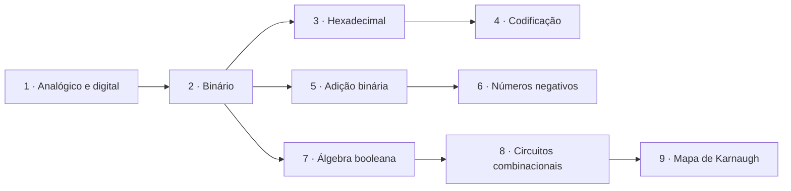

# 🔌 Sistemas Digitais

> [← voltar para Conteúdo](../README.md)

**Nível:** 🟢 Iniciante

Como o computador guarda números, letras e cores usando **só 0 e 1**, e como ele faz contas e toma decisões com **portas lógicas**. Este tema começa do zero: não precisa saber nada de eletrônica, só de matemática do ensino fundamental.

## 🧭 Como estudar

1. **Leia a aula** na ordem. Cada uma tem teoria, passo a passo e vários exemplos resolvidos.
2. **Faça o teste rápido** do fim da aula. No site, digite a resposta e clique em **Conferir**: o site corrige na hora.
3. **Errou?** Abra **Ver resposta** para ver a resolução comentada, refaça a conta e confira de novo.
4. **Pratique com os [exercícios](exercicios/README.md)** do assunto: 9 por aula, do fácil ao difícil.
5. Só passe para a próxima aula quando acertar a maioria. As aulas dependem umas das outras.
6. **Terminou as 9 aulas?** Faça os [simulados de Sistemas Digitais](../../simulados/README.md#-sistemas-digitais), com tempo marcado e pontuação.

> 💡 **Estude com papel e lápis.** Nesta disciplina a prova é feita à mão e sem calculadora. Ler o exemplo não basta: copie a conta e refaça sozinho.

## 🗺️ Roteiro de estudo

| # | Aula | Nível | O que você aprende | Exercícios |
| - | ---- | ----- | ------------------ | ---------- |
| 1 | [Analógico e digital](aulas/01-analogico-e-digital.md) | 🟢 Iniciante | O que é um sinal digital, amostragem, ADC/DAC e por que o computador usa 0 e 1 | [🟢](exercicios/01-analogico-e-digital/facil.md) · [🟡](exercicios/01-analogico-e-digital/intermediario.md) · [🔴](exercicios/01-analogico-e-digital/dificil.md) |
| 2 | [Sistema binário](aulas/02-sistema-binario.md) | 🟢 Iniciante | Contar em binário, converter de e para decimal (com vírgula) e quanto cabe em n bits | [🟢](exercicios/02-binario/facil.md) · [🟡](exercicios/02-binario/intermediario.md) · [🔴](exercicios/02-binario/dificil.md) |
| 3 | [Hexadecimal](aulas/03-hexadecimal.md) | 🟢 Iniciante | A base 16, o prefixo `0x` e o atalho dos grupos de 4 bits | [🟢](exercicios/03-hexadecimal/facil.md) · [🟡](exercicios/03-hexadecimal/intermediario.md) · [🔴](exercicios/03-hexadecimal/dificil.md) |
| 4 | [Codificação](aulas/04-codificacao.md) | 🟢 Iniciante | Letras em ASCII, Cifra de César, cores em RGB e o tamanho de uma imagem | [🟢](exercicios/04-codificacao/facil.md) · [🟡](exercicios/04-codificacao/intermediario.md) · [🔴](exercicios/04-codificacao/dificil.md) |
| 5 | [Adição binária](aulas/05-adicao-binaria.md) | 🟡 Intermediário | Somar em binário com o "vai um" | [🟢](exercicios/05-adicao-binaria/facil.md) · [🟡](exercicios/05-adicao-binaria/intermediario.md) · [🔴](exercicios/05-adicao-binaria/dificil.md) |
| 6 | [Números negativos](aulas/06-numeros-negativos.md) | 🟡 Intermediário | Sinal-magnitude, complemento a 1 e a 2, subtração e overflow | [🟢](exercicios/06-numeros-negativos/facil.md) · [🟡](exercicios/06-numeros-negativos/intermediario.md) · [🔴](exercicios/06-numeros-negativos/dificil.md) |
| 7 | [Álgebra booleana](aulas/07-algebra-booleana.md) | 🟡 Intermediário | As portas NOT, AND, OR, NAND, NOR e XOR e suas propriedades | [🟢](exercicios/07-algebra-booleana/facil.md) · [🟡](exercicios/07-algebra-booleana/intermediario.md) · [🔴](exercicios/07-algebra-booleana/dificil.md) |
| 8 | [Circuitos combinacionais](aulas/08-circuitos-combinacionais.md) | 🟡 Intermediário | Expressão ↔ circuito ↔ tabela-verdade e soma de produtos | [🟢](exercicios/08-circuitos/facil.md) · [🟡](exercicios/08-circuitos/intermediario.md) · [🔴](exercicios/08-circuitos/dificil.md) |
| 9 | [Mapa de Karnaugh](aulas/09-mapa-de-karnaugh.md) | 🔴 Avançado | Simplificar circuitos com o mapa e projetar um circuito do zero | [🟢](exercicios/09-karnaugh/facil.md) · [🟡](exercicios/09-karnaugh/intermediario.md) · [🔴](exercicios/09-karnaugh/dificil.md) |

## ✍️ Como responder no corretor

O corretor do site entende vários jeitos de escrever a mesma resposta:

| Tipo de resposta | Pode escrever assim | Também aceita |
| ---------------- | ------------------- | ------------- |
| Binário | `101101` | `0010 1101`, `(101101)₂` |
| Com vírgula | `11,75` | `11.75` |
| Hexadecimal | `2D` | `0x2D`, `2d` |
| Expressão booleana | `A'B + C` | `!A·B + C`, `(A')(B) + C`, `B·A' + C` |

Nas expressões, use `'` (ou `!`) para **NOT**, `+` para **OR**, nada (ou `·`) para **AND** e `⊕` (ou `^`) para **XOR**. Qualquer expressão **equivalente** é aceita. Quando a pergunta pede a forma **mínima**, o corretor também avisa se ainda dá para simplificar.

> ⚠️ O corretor só existe no site <https://rps4-school.github.io/school-cc/>. No GitHub, abra **Ver resposta** para conferir.

## 🔗 Links úteis

- [CircuitVerse](https://circuitverse.org/simulator): monte e teste circuitos com portas lógicas no navegador, de graça.
- [Tabela ASCII completa](https://www.asciitable.com/): códigos de todas as letras e símbolos.

## 📁 Conteúdo desta pasta

| Pasta | O que vai aqui |
| ----- | -------------- |
| [`aulas/`](aulas/) | Uma aula completa por assunto, com exemplos e teste rápido |
| [`exercicios/`](exercicios/README.md) | 81 exercícios (9 por assunto) com resolução passo a passo |
| `img/` | Figuras das aulas (portas, circuitos e mapas) |

## 📚 Referências

- TOCCI, Ronald J.; WIDMER, Neal S.; MOSS, Gregory L. *Sistemas digitais: princípios e aplicações*. 11. ed. São Paulo: Pearson, 2011. Capítulos 1 a 4 e 6.
- IDOETA, Ivan V.; CAPUANO, Francisco G. *Elementos de eletrônica digital*. 42. ed. São Paulo: Érica, 2019.
- [Khan Academy: sistema binário (em português)](https://pt.khanacademy.org/computing/computers-and-internet/xcae6f4a7ff015e7d:digital-information)
