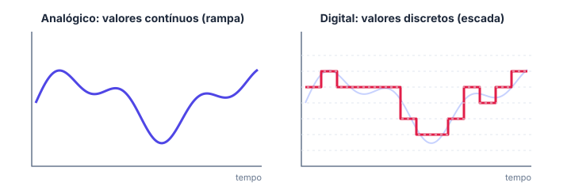
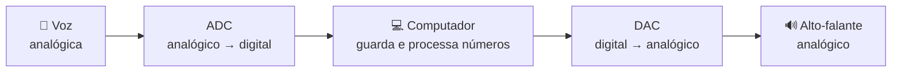
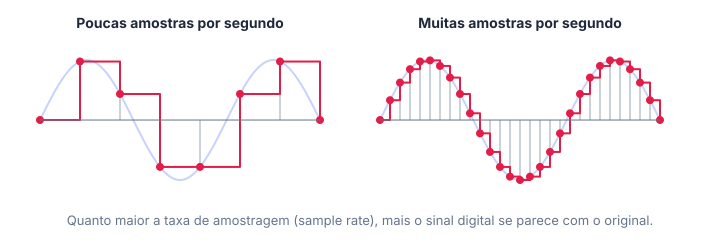

# 📡 Analógico e digital

> [← voltar para Sistemas Digitais](../README.md) · Próximo: [Sistema binário →](02-sistema-binario.md)

**Nível:** 🟢 Iniciante

## 🎯 Você vai aprender

- A diferença entre um sinal **analógico** e um sinal **digital**, com exemplos do dia a dia.
- O que é **amostragem** (*sample rate*) e por que ela muda a qualidade de um áudio.
- O papel do **ADC** e do **DAC**, as "pontes" entre o mundo real e o computador.
- Por que o computador trabalha só com **0 e 1**, e o que o **transistor** tem a ver com isso.

## Em uma frase

> 💡 **Analógico** pode assumir **qualquer valor** dentro de uma faixa (como uma rampa). **Digital** só assume **alguns valores definidos** (como uma escada).

## Rampa × escada

Imagine subir até o segundo andar de dois jeitos:

| | Rampa | Escada |
| - | ----- | ------ |
| Onde você pode parar? | Em **qualquer** altura: 1 m, 1,3 m, 1,3172 m... | Só **em cima de um degrau**: degrau 1, 2, 3... |
| Quantas posições existem? | **Infinitas** | Uma quantidade **finita** |
| Tipo de sinal | **Analógico** (contínuo) | **Digital** (discreto) |



A natureza é quase toda analógica: temperatura, som, luz e pressão variam de forma contínua. O computador é digital: ele só entende valores definidos.

### Exemplos para fixar

| Situação | Tipo | Por quê |
| -------- | ---- | ------- |
| Termômetro de mercúrio | Analógico | A coluna sobe de forma contínua |
| Termômetro com visor de números | Digital | Mostra valores fixos, como 36,5 ou 36,6 |
| Relógio de ponteiros que deslizam | Analógico | O ponteiro passa por todas as posições |
| Relógio que mostra 14:05 | Digital | Pula de minuto em minuto |
| Volume do celular (barrinhas) | Digital | Tem uma quantidade fixa de níveis |
| Voz chegando ao microfone | Analógico | A pressão do ar varia continuamente |
| Arquivo MP3 | Digital | São números guardados na memória |

> 📖 **Dica para a prova:** pergunte "dá para ter um valor **entre** dois valores possíveis?". Se sim, é analógico. Se não, é digital.

## Analógico × digital: vantagens e desvantagens

| | Analógico | Digital |
| - | --------- | ------- |
| Precisão | Representa o valor exato | É sempre uma **aproximação** (perde detalhes entre os degraus) |
| Ruído | Qualquer interferência muda o valor | Um 0 "sujo" continua sendo lido como 0 |
| Cópia | Cada cópia perde qualidade (fita cassete) | A cópia é **idêntica** ao original |
| Guardar e processar | Difícil | Fácil: é só número na memória |
| Exemplos | Disco de vinil, rádio AM/FM antigo | Streaming, foto do celular, pendrive |

> 💡 É por isso que quase tudo virou digital: ruído quase não atrapalha, dá para copiar sem perda e o computador consegue guardar e calcular.

## Do mundo real para o computador: ADC e DAC

Para o computador "ouvir" sua voz, o som precisa virar número. Para você ouvir uma música, os números precisam virar som de novo.



| Sigla | Nome | O que faz | Onde existe |
| ----- | ---- | --------- | ----------- |
| **ADC** | *Analog-to-Digital Converter* (conversor analógico-digital) | Mede o sinal e transforma em números | Microfone do celular, sensor de temperatura |
| **DAC** | *Digital-to-Analog Converter* (conversor digital-analógico) | Transforma números em sinal contínuo | Saída de fone de ouvido, placa de som |

## Amostragem (*sample rate*)

O ADC não mede o sinal o tempo todo: ele tira **"fotos" (amostras)** em intervalos regulares. A **taxa de amostragem** (*sample rate*) é **quantas amostras por segundo** ele tira, medida em hertz (Hz).



| Taxa de amostragem | Resultado |
| ------------------ | --------- |
| Baixa (poucas amostras) | Os degraus ficam grandes; o som fica "robótico" ou abafado |
| Alta (muitas amostras) | Os degraus ficam pequenos; o digital fica bem parecido com o original |

**Exemplo:** um áudio de qualidade de CD usa **44 100 amostras por segundo** (44,1 kHz). Uma música de 3 minutos (180 segundos) tem:

```
44 100 amostras/s × 180 s = 7 938 000 amostras (em cada canal)
```

> ⚠️ Mais amostras = mais qualidade, mas também **arquivo maior**. É sempre uma troca.

## Por que só 0 e 1?

Dentro do computador, cada informação é uma **tensão elétrica** num fio. Seria possível usar 10 níveis de tensão (um para cada algarismo), mas com tanto nível um pequeno ruído já faria o computador confundir um 6 com um 7.

Com **só dois níveis**, a margem é enorme:

| Tensão no fio | Significado |
| ------------- | ----------- |
| Baixa (perto de 0 V) | **0** (desligado, falso) |
| Alta (perto da tensão do circuito, por exemplo 5 V) | **1** (ligado, verdadeiro) |

Cada 0 ou 1 é um **bit** (*binary digit*). É assim que nasce o **sistema binário**, assunto da próxima aula.

### O transistor: uma chave que liga e desliga

Quem cria esses 0 e 1 é o **transistor**: um interruptor minúsculo, sem partes móveis, que liga e desliga bilhões de vezes por segundo.

| Transistor | Sai |
| ---------- | --- |
| Conduz | 1 |
| Não conduz | 0 |

A **Lei de Moore** (Gordon Moore, 1965) observou que a quantidade de transistores que cabe num chip **dobra a cada período de cerca de 18 a 24 meses**. Por isso os computadores ficaram tão mais rápidos e baratos.

| Ano | Tamanho típico do transistor |
| --- | ---------------------------- |
| 1971 | 10 µm (micrômetros) |
| 2001 | 130 nm (nanômetros) |
| 2017 | 10 nm |

## ⚠️ Erros comuns

| Erro | Como evitar |
| ---- | ----------- |
| Achar que "digital" significa "tem tela" | Digital é ter **valores definidos**. Um relógio com tela pode imitar ponteiros; o que importa é o sinal |
| Trocar ADC por DAC | Leia a sigla na ordem: **A**nalógico **→** **D**igital = ADC |
| Pensar que digital é sempre "melhor" em precisão | O digital **perde** o que fica entre os degraus. Ele ganha em ruído, cópia e processamento |

## 💡 Macetes

- **Rampa ou escada?** Rampa = analógico, escada = digital.
- **ADC**: o **A** vem antes do **D**, então vai do **A**nalógico para o **D**igital. No **DAC** é o contrário.
- Taxa de amostragem × tempo = **número de amostras**.

## ✅ Teste rápido

**1.** Uma balança de mola, com ponteiro que gira livremente, é analógica ou digital?

<details>
<summary>Ver resposta</summary>

**Resposta:** `analógica | analógico`

O ponteiro pode parar em **qualquer** posição entre duas marcas: o valor é contínuo.
</details>

**2.** O botão de volume da TV muda de 1 em 1, de 0 até 50. Esse controle é analógico ou digital?

<details>
<summary>Ver resposta</summary>

**Resposta:** `digital`

Só existem 51 valores possíveis (0, 1, 2... 50). Não dá para ter volume 12,5.
</details>

**3.** Qual é a sigla do conversor que transforma o som do microfone em números?

<details>
<summary>Ver resposta</summary>

**Resposta:** `ADC`

**A**nalógico → **D**igital: *Analog-to-Digital Converter*.
</details>

**4.** Um gravador tira 8 000 amostras por segundo. Quantas amostras ele guarda em 5 segundos?

<details>
<summary>Ver resposta</summary>

**Resposta:** `40000`

Amostras = taxa × tempo = 8 000 × 5 = **40 000**.
</details>

**5.** Um chip tem 1 milhão de transistores. Se a quantidade dobrar a cada 2 anos, quantos transistores (em milhões) um chip terá daqui a 6 anos?

<details>
<summary>Ver resposta</summary>

**Resposta:** `8 | 8 milhões | 8000000`

Em 6 anos são 3 períodos de 2 anos, então dobra 3 vezes: 1 → 2 → 4 → **8 milhões**.
</details>

**6.** Quantos níveis de tensão diferentes um circuito binário usa?

<details>
<summary>Ver resposta</summary>

**Resposta:** `2 | dois`

Só dois: **baixo** (0) e **alto** (1). Por isso o ruído atrapalha tão pouco.
</details>

## ✏️ Agora pratique

São 9 exercícios sobre este assunto, do fácil ao difícil, com resolução passo a passo:

| 🟢 Fácil | 🟡 Intermediário | 🔴 Difícil |
| -------- | ---------------- | ---------- |
| [Exercícios 01 a 03](../exercicios/01-analogico-e-digital/facil.md) | [Exercícios 04 a 06](../exercicios/01-analogico-e-digital/intermediario.md) | [Exercícios 07 a 09](../exercicios/01-analogico-e-digital/dificil.md) |

## 📚 Referências

- TOCCI, Ronald J.; WIDMER, Neal S.; MOSS, Gregory L. *Sistemas digitais: princípios e aplicações*. 11. ed. Pearson, 2011. Capítulo 1 (seções 1.1 a 1.3).
- [Khan Academy: como o computador guarda sons (em português)](https://pt.khanacademy.org/computing/computers-and-internet/xcae6f4a7ff015e7d:digital-information/xcae6f4a7ff015e7d:storing-sound/a/storing-sound)
