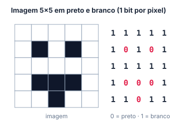

# 🔤 Codificação

> [← Hexadecimal](03-hexadecimal.md) · Próximo: [Adição binária →](05-adicao-binaria.md)

**Nível:** 🟢 Iniciante

## 🎯 Você vai aprender

- O que é um **código** e por que tudo no computador vira número.
- Transformar texto em **ASCII** (em hexadecimal) e de volta.
- Cifrar e decifrar com a **Cifra de César**, à mão e "do jeito do computador".
- Como as **cores** são guardadas (**RGB**, **RGBA** e o `#RRGGBB`).
- Calcular o **tamanho de uma imagem** e usar as unidades **bit, byte, KB e MB**.

## Em uma frase

> 💡 **Código** é uma tabela combinada entre quem escreve e quem lê: "o número tal significa a letra tal" (ou a cor tal, ou o pixel tal). O computador só guarda números; o código dá o significado.

## 1. ASCII: letras viram números

O **ASCII** (1963) usa **7 bits** por caractere: 2⁷ = **128** símbolos. Inclui letras maiúsculas e minúsculas, algarismos, pontuação e alguns caracteres de controle (como "nova linha"). Depois surgiu a versão estendida de **8 bits** (256 símbolos).

### Tabela ASCII (caracteres visíveis)

Para achar o código: **linha** = primeiro algarismo hexa, **coluna** = segundo. Exemplo: `A` está na linha **4** e coluna **1**, então `A = 0x41`.

| | 0 | 1 | 2 | 3 | 4 | 5 | 6 | 7 | 8 | 9 | A | B | C | D | E | F |
| - | - | - | - | - | - | - | - | - | - | - | - | - | - | - | - | - |
| **2** | espaço | ! | " | # | $ | % | & | ' | ( | ) | \* | + | , | - | . | / |
| **3** | 0 | 1 | 2 | 3 | 4 | 5 | 6 | 7 | 8 | 9 | : | ; | &lt; | = | &gt; | ? |
| **4** | @ | A | B | C | D | E | F | G | H | I | J | K | L | M | N | O |
| **5** | P | Q | R | S | T | U | V | W | X | Y | Z | [ | \\ | ] | ^ | \_ |
| **6** | &#96; | a | b | c | d | e | f | g | h | i | j | k | l | m | n | o |
| **7** | p | q | r | s | t | u | v | w | x | y | z | { | \| | } | ~ | |

### Exemplo 1: "Oi!" em ASCII

| Caractere | Linha | Coluna | Hexa | Binário (8 bits) |
| --------- | ----- | ------ | ---- | ---------------- |
| O | 4 | F | 0x4F | 0100 1111 |
| i | 6 | 9 | 0x69 | 0110 1001 |
| ! | 2 | 1 | 0x21 | 0010 0001 |

**"Oi!" = 0x4F 0x69 0x21**. São 3 caracteres, então ocupa **3 bytes**.

### Exemplo 2: decodificando 0x42 0x69 0x74

0x42 → linha 4, coluna 2 → **B**; 0x69 → **i**; 0x74 → **t**. A mensagem é **"Bit"**.

> 💡 **Padrões úteis:**
>
> - Maiúscula e minúscula diferem sempre em **0x20** (32): `A` = 0x41 e `a` = 0x61.
> - O algarismo `0` é **0x30**, `1` é 0x31... `9` é 0x39. Ou seja, o caractere "7" **não** vale 7: vale 0x37.
> - O espaço também é um caractere: **0x20**.

> 📖 **Para ir além:** 128 símbolos não têm "ç", "ã" nem emoji. Por isso hoje se usa o **Unicode** (mais de 140 mil caracteres), geralmente gravado em **UTF-8**, que é compatível com o ASCII nos primeiros 128 códigos.

## 2. Cifra de César

Júlio César mandava mensagens trocando cada letra pela que está **n posições à frente** no alfabeto. O **n** é a chave.

**Exemplo 3: cifrar "prova" com chave 3**

| Original | p | r | o | v | a |
| -------- | - | - | - | - | - |
| +3 | **s** | **u** | **r** | **y** | **d** |

"prova" → **"suryd"**

Quando passa do **z**, volta para o começo do alfabeto:

| Original | x | y | z |
| -------- | - | - | - |
| +3 | a | b | c |

**Exemplo 4:** "zebra" com chave 3 → **"cheud"** (z → c, e → h, b → e, r → u, a → d).

**Para decifrar**, ande **n posições para trás**: "khoor" com chave 3 → **"hello"**.

### O jeito do computador

O computador não "conta letras": ele **soma a chave ao código ASCII**.

| Letra | ASCII | + 3 | Resultado |
| ----- | ----- | --- | --------- |
| A | 0x41 | 0x44 | D |
| B | 0x42 | 0x45 | E |

Se o resultado passar de `Z` (0x5A), o programa **subtrai 26** para voltar ao começo do alfabeto.

> ⚠️ A Cifra de César é **muito fraca**: só existem 25 chaves possíveis, então dá para testar todas em segundos. Ela é usada para ensinar a ideia de criptografia, não para proteger nada.

## 3. Cores: RGB

A tela forma cada cor misturando luz **vermelha (R)**, **verde (G)** e **azul (B)**. Cada canal usa **8 bits** (0 a 255):

| Cor | R | G | B | Hexadecimal |
| --- | - | - | - | ----------- |
| Preto | 0 | 0 | 0 | `#000000` |
| Branco | 255 | 255 | 255 | `#FFFFFF` |
| Vermelho | 255 | 0 | 0 | `#FF0000` |
| Verde | 0 | 255 | 0 | `#00FF00` |
| Azul | 0 | 0 | 255 | `#0000FF` |
| Amarelo (vermelho + verde) | 255 | 255 | 0 | `#FFFF00` |
| Laranja | 255 | 128 | 0 | `#FF8000` |

O código `#RRGGBB` é só **os três bytes em hexadecimal**, um atrás do outro.

**Exemplo 5: #1E90FF em RGB**

| Canal | Hexa | Decimal |
| ----- | ---- | ------- |
| R | 1E | 1 × 16 + 14 = **30** |
| G | 90 | 9 × 16 + 0 = **144** |
| B | FF | **255** |

**#1E90FF = (30, 144, 255)**, um azul claro.

| Formato | Bits por pixel | Cores possíveis |
| ------- | -------------- | --------------- |
| **RGB** ("true color") | 3 × 8 = **24** | 2²⁴ = **16 777 216** |
| **RGBA** (+ canal **alfa**, a transparência) | 4 × 8 = **32** | 2³² = 4 294 967 296 combinações |

> 📖 RGB é um modelo **aditivo** (soma luz): é o das telas. Na impressão se usa o **CMYK**, que é **subtrativo** (tinta absorve luz).

## 4. Imagens e tamanho de arquivo

Uma imagem é uma **matriz de pixels**. Cada pixel guarda um número:

| Tipo de imagem | Bits por pixel | Significado do número |
| -------------- | -------------- | --------------------- |
| Preto e branco | **1** | 0 = preto, 1 = branco |
| Tons de cinza | **8** | 0 = preto ... 255 = branco |
| Colorida (RGB) | **24** | 8 bits para R, G e B |



### 🧮 Fórmula

```
tamanho (em bits) = largura × altura × bits por pixel
```

### Unidades

| Unidade | Vale |
| ------- | ---- |
| 1 byte (B) | 8 bits (b) |
| 1 KB (kilobyte) | 1 024 bytes = 2¹⁰ B |
| 1 MB (megabyte) | 1 024 KB = 2²⁰ B |
| 1 Kb (kilo**bit**, "b" minúsculo) | 1 024 bits |

> ⚠️ **B maiúsculo = byte, b minúsculo = bit.** 1 KB tem 8 vezes mais informação que 1 Kb. (Nesta disciplina, 1 K = 1 024.)

**Exemplo 6: a carinha 5 × 5 acima**

5 × 5 × 1 bit = **25 bits**.

**Exemplo 7: foto 1920 × 1080 em tons de cinza**

```
1920 × 1080 × 8 bits = 1920 × 1080 bytes = 2 073 600 bytes
2 073 600 ÷ 1 048 576 ≈ 1,98 MB
```

A mesma foto **colorida** (24 bits = 3 bytes por pixel): 2 073 600 × 3 = 6 220 800 bytes ≈ **5,93 MB**.

**Exemplo 8: quantos pixels cabem em 1 KB?**

| Imagem | Conta | Pixels |
| ------ | ----- | ------ |
| Preto e branco (1 bit) | 1 024 bytes × 8 bits ÷ 1 bit | **8 192** |
| Tons de cinza (8 bits) | 1 024 bytes ÷ 1 byte | **1 024** |

> 💡 Arquivos reais (JPG, PNG) usam **compressão** e ficam bem menores. A conta acima é o tamanho "cru", sem compressão.

## ⚠️ Erros comuns

| Erro | Como evitar |
| ---- | ----------- |
| Achar o código ASCII em decimal quando pedem hexa | A tabela acima já está em **hexa**: linha + coluna |
| Esquecer de "dar a volta" na Cifra de César | Depois do **z** vem o **a** |
| Confundir KB com Kb | **B** = byte, **b** = bit; multiplique ou divida por 8 |
| Usar 1 000 no lugar de 1 024 | Nesta disciplina, 1 KB = 2¹⁰ = **1 024** bytes |
| Trocar a ordem dos canais | É sempre **R**, depois **G**, depois **B** |

## 💡 Macetes

- **Maiúscula → minúscula:** some 0x20.
- **Cor em hexa:** separe de 2 em 2 algarismos e converta cada par para decimal.
- **Tamanho de imagem:** faça a conta em **bits**, e só no fim divida por 8 (bytes), depois por 1 024 (KB) e por 1 024 de novo (MB).

## ✅ Teste rápido

**1.** Qual é o código ASCII, em hexadecimal, da letra **A** maiúscula?

<details>
<summary>Ver resposta</summary>

**Resposta:** `41`

Linha **4**, coluna **1**: **0x41**.
</details>

**2.** Escreva **"SD"** em ASCII (hexadecimal).

<details>
<summary>Ver resposta</summary>

**Resposta:** `0x53 0x44`

S → linha 5, coluna 3 → **0x53**; D → linha 4, coluna 4 → **0x44**.
</details>

**3.** Se `A` = 0x41, qual é o código da letra **a** minúscula?

<details>
<summary>Ver resposta</summary>

**Resposta:** `61`

Minúscula = maiúscula + 0x20: 0x41 + 0x20 = **0x61**.
</details>

**4.** Cifre **"hal"** com a Cifra de César de chave **1**.

<details>
<summary>Ver resposta</summary>

**Resposta:** `ibm`

h → **i**, a → **b**, l → **m**. (Uma curiosidade: HAL é o computador do filme *2001: Uma Odisseia no Espaço*.)
</details>

**5.** Decifre **"fdvd"**, cifrada com chave **3**.

<details>
<summary>Ver resposta</summary>

**Resposta:** `casa`

Ande 3 letras para trás: f → **c**, d → **a**, v → **s**, d → **a**.
</details>

**6.** Escreva a cor RGB **(255, 128, 0)** no formato hexadecimal `#RRGGBB` (sem o #).

<details>
<summary>Ver resposta</summary>

**Resposta:** `FF8000`

255 = **FF**; 128 = 8 × 16 = **80**; 0 = **00**. Fica **#FF8000** (laranja).
</details>

**7.** Quantos **bytes** ocupa uma imagem de **100 × 100** pixels em tons de cinza (8 bits por pixel), sem compressão?

<details>
<summary>Ver resposta</summary>

**Resposta:** `10000`

100 × 100 × 8 bits = 80 000 bits ÷ 8 = **10 000 bytes**.
</details>

**8.** Quantos **bits** tem 1 KB?

<details>
<summary>Ver resposta</summary>

**Resposta:** `8192`

1 KB = 1 024 bytes × 8 = **8 192 bits**.
</details>

## ✏️ Agora pratique

São 9 exercícios sobre este assunto, do fácil ao difícil, com resolução passo a passo:

| 🟢 Fácil | 🟡 Intermediário | 🔴 Difícil |
| -------- | ---------------- | ---------- |
| [Exercícios 01 a 03](../exercicios/04-codificacao/facil.md) | [Exercícios 04 a 06](../exercicios/04-codificacao/intermediario.md) | [Exercícios 07 a 09](../exercicios/04-codificacao/dificil.md) |

## 📚 Referências

- TOCCI, Ronald J.; WIDMER, Neal S.; MOSS, Gregory L. *Sistemas digitais: princípios e aplicações*. 11. ed. Pearson, 2011. Seção 2.8 (códigos alfanuméricos).
- [Khan Academy: como o computador representa texto e imagens (em português)](https://pt.khanacademy.org/computing/computers-and-internet/xcae6f4a7ff015e7d:digital-information)
