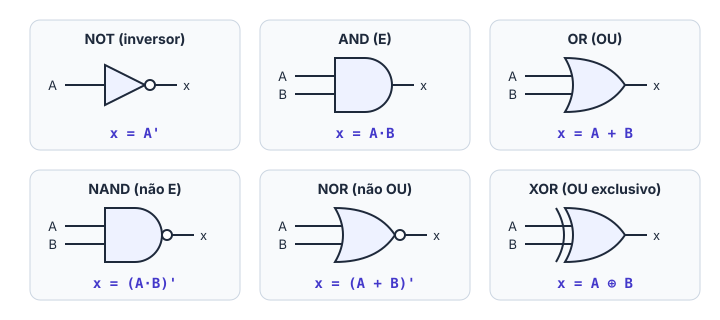
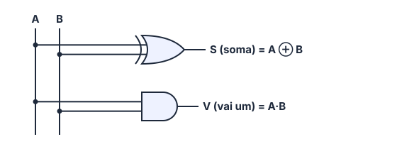

# 🔀 Álgebra booleana

> [← Números negativos](06-numeros-negativos.md) · Próximo: [Circuitos combinacionais →](08-circuitos-combinacionais.md)

**Nível:** 🟡 Intermediário

## 🎯 Você vai aprender

- O que é a **álgebra booleana** e por que ela só tem dois valores.
- As três operações básicas, **NOT**, **AND** e **OR**, com símbolo, expressão e tabela-verdade.
- As **8 propriedades** que simplificam expressões.
- As portas derivadas: **NAND**, **NOR** e **XOR**.
- Como **somar dois bits** usando portas lógicas.

## Em uma frase

> 💡 Álgebra booleana é a matemática do **sim e não**: as variáveis só valem **0 ou 1**, e as contas descrevem quando a saída de um circuito liga (1) ou desliga (0).

## 1. Só dois valores

Criada por George Boole em 1854, ela usa só **0 e 1**, que podem significar:

| 0 | 1 |
| - | - |
| Falso | Verdadeiro |
| Desligado | Ligado |
| Não | Sim |
| Tensão baixa (LOW) | Tensão alta (HIGH) |
| Aberto | Fechado |

Não existem frações, negativos nem "2". Por isso tudo fica bem mais simples que a álgebra comum.

Uma **tabela-verdade** lista **todas** as combinações de entrada e a saída de cada uma. Com **n** entradas, a tabela tem **2ⁿ linhas**, sempre na ordem de contagem binária (00, 01, 10, 11...).

## 2. As três operações básicas

### NOT (inversor): "o contrário"

| Expressão | Lê-se |
| --------- | ----- |
| x = **A'** | "A barrado" ou "não A" |

Também aparece como **Ā** ou **!A**.

| A | x = A' |
| - | ------ |
| 0 | 1 |
| 1 | 0 |

**No dia a dia:** a luz de "porta aberta" do carro acende quando a porta **não** está fechada.

### AND (E): "todos precisam"

| Expressão | Lê-se |
| --------- | ----- |
| x = **A · B** ou **AB** | "A e B" |

| A | B | x = AB |
| - | - | ------ |
| 0 | 0 | 0 |
| 0 | 1 | 0 |
| 1 | 0 | 0 |
| 1 | 1 | **1** |

**No dia a dia:** o carro só dá partida se a **chave** estiver girada **E** o **pé estiver no freio**.

> 💡 AND parece a **multiplicação**: 1 · 1 = 1 e qualquer coisa vezes 0 dá 0.

### OR (OU): "basta um"

| Expressão | Lê-se |
| --------- | ----- |
| x = **A + B** | "A ou B" |

| A | B | x = A + B |
| - | - | --------- |
| 0 | 0 | **0** |
| 0 | 1 | 1 |
| 1 | 0 | 1 |
| 1 | 1 | 1 |

**No dia a dia:** o portão da garagem abre se apertarem o **controle remoto** **OU** o **botão da parede**.

> ⚠️ **1 + 1 = 1** na álgebra booleana. O "+" aqui é **OU**, não é soma: se pelo menos um é verdadeiro, o resultado é verdadeiro.

### Os símbolos

### Portas com várias entradas

| Porta | Saída 1 quando... | Saída 0 quando... |
| ----- | ----------------- | ----------------- |
| AND de n entradas | **todas** as entradas são 1 (uma única combinação) | pelo menos uma é 0 |
| OR de n entradas | pelo menos uma é 1 | **todas** são 0 (uma única combinação) |

**Exemplo 1:** numa AND de 4 entradas, das 2⁴ = 16 combinações, só **1111** dá saída 1. Numa OR de 4 entradas, só **0000** dá saída 0.

### AND como "habilitador"

Uma entrada da AND pode funcionar como um **interruptor geral**:

| Controle C | Saída de C · A |
| ---------- | -------------- |
| 0 | sempre **0** (bloqueia A) |
| 1 | igual a **A** (deixa A passar) |

É assim que um alarme "ligado/desligado" funciona: alarme = L · (sensor).

## 3. As 8 propriedades

Elas saem direto das tabelas-verdade. Com elas você simplifica uma expressão sem montar tabela nenhuma:

| OR | AND | Por quê |
| -- | --- | ------- |
| A + 0 = **A** | A · 1 = **A** | 0 não muda a OR; 1 não muda a AND |
| A + 1 = **1** | A · 0 = **0** | Na OR basta um 1; na AND basta um 0 |
| A + A = **A** | A · A = **A** | Repetir não muda nada |
| A + A' = **1** | A · A' = **0** | Um dos dois sempre é 1 (e sempre é 0) |

E a **dupla negação**: **(A')' = A**. Dois inversores seguidos se anulam.

**Exemplo 2: simplifique x = A · 1 + B · 0**

| Passo | Expressão | Propriedade |
| ----- | --------- | ----------- |
| 1 | A · 1 + B · 0 | — |
| 2 | A + B · 0 | A · 1 = A |
| 3 | A + 0 | B · 0 = 0 |
| 4 | **A** | A + 0 = A |

**Exemplo 3: simplifique x = A'B + AB**

Colocando B em evidência (como na álgebra comum): x = B(A' + A) = B · 1 = **B**. Faz sentido: se B = 1, a saída é 1 com A valendo 0 **ou** 1. Essa ideia é a base do Mapa de Karnaugh.

## 4. Portas derivadas

### NAND (não E) e NOR (não OU)

São a AND e a OR com um **inversor na saída** (a bolinha no símbolo):

| A | B | AND | **NAND = (AB)'** | OR | **NOR = (A + B)'** |
| - | - | --- | ---------------- | -- | ------------------ |
| 0 | 0 | 0 | **1** | 0 | **1** |
| 0 | 1 | 0 | **1** | 1 | **0** |
| 1 | 0 | 0 | **1** | 1 | **0** |
| 1 | 1 | 1 | **0** | 1 | **0** |

**No dia a dia (NOR):** "vou ficar em casa se **não** chover **nem** fizer frio". A saída só é 1 quando as duas entradas são 0.

### XOR (OU exclusivo): "um ou outro, mas não os dois"

| Expressão | Lê-se |
| --------- | ----- |
| x = **A ⊕ B** = A'B + AB' | "A xor B" |

| A | B | x = A ⊕ B |
| - | - | --------- |
| 0 | 0 | 0 |
| 0 | 1 | **1** |
| 1 | 0 | **1** |
| 1 | 1 | 0 |

**No dia a dia:** o interruptor de escada (*three-way*). A luz acende quando os dois interruptores estão em posições **diferentes**.

> 💡 **XOR = "são diferentes?"** Dá 1 quando as entradas são diferentes e 0 quando são iguais.

## 5. Somando dois bits com portas lógicas

Lembra da tabuada da [adição binária](05-adicao-binaria.md)? Monte a tabela-verdade da soma de 1 bit, com duas saídas: **S** (o bit do resultado) e **V** (o vai um).

| A | B | V (vai um) | S (soma) |
| - | - | ---------- | -------- |
| 0 | 0 | 0 | 0 |
| 0 | 1 | 0 | 1 |
| 1 | 0 | 0 | 1 |
| 1 | 1 | 1 | 0 |

Compare com as tabelas acima:

- A coluna **S** é igual à tabela da **XOR**: **S = A ⊕ B**.
- A coluna **V** é igual à tabela da **AND**: **V = A · B**.

Este circuito é o **meio-somador** (*half adder*). Juntando vários deles, o processador soma números de 8, 32 ou 64 bits.

## ⚠️ Erros comuns

| Erro | Como evitar |
| ---- | ----------- |
| Escrever 1 + 1 = 2 (ou 10) | Na álgebra booleana, **1 + 1 = 1** (é OU) |
| Confundir OR com XOR | OR dá 1 com **1 e 1**; XOR dá **0** |
| Esquecer a bolinha da NAND e da NOR | A bolinha **inverte** a saída |
| Montar a tabela fora de ordem | Sempre em ordem binária: 00, 01, 10, 11 |
| Achar que A + A' = A | Um dos dois sempre é 1: **A + A' = 1** |

## 💡 Macetes

- **AND = "todos"**, **OR = "pelo menos um"**, **XOR = "diferentes"**.
- **NAND e NOR são a AND e a OR de cabeça para baixo:** copie a tabela e inverta a coluna da saída.
- **Linhas da tabela = 2ⁿ:** 2 entradas → 4 linhas; 3 → 8; 4 → 16.

## ✅ Teste rápido

**1.** Qual é a saída de uma porta **AND** com A = 1 e B = 0?

Ver resposta

**Resposta:** `0`

Na AND, basta uma entrada 0 para a saída ser **0**.

**2.** Qual é a saída de uma porta **NOR** com A = 0 e B = 0?

Ver resposta

**Resposta:** `1`

OR(0, 0) = 0; invertendo, NOR = **1**.

**3.** Simplifique **A · 1**.

Ver resposta

**Expressão:** `A`

1 não muda a AND: A · 1 = **A**.

**4.** Quanto vale **A + A'** (0 ou 1)?

Ver resposta

**Resposta:** `1`

Se A = 0, então A' = 1; se A = 1, A já é 1. Em qualquer caso, a OR dá **1**.

**5.** Numa porta **OR de 3 entradas**, quantas das 8 combinações dão saída **1**?

Ver resposta

**Resposta:** `7`

Só a combinação 000 dá 0. As outras **7** dão 1.

**6.** Escreva a coluna da saída da **XOR** para as entradas 00, 01, 10 e 11, nessa ordem (os quatro bits juntos).

Ver resposta

**Resposta:** `0110`

Entradas iguais → 0; diferentes → 1: **0, 1, 1, 0**.

**7.** Um alarme toca quando o sensor da porta (**P**) **ou** o sensor da janela (**J**) detecta abertura, mas só se o alarme estiver ligado (**L**). Escreva a expressão da saída.

Ver resposta

**Expressão:** `L(P + J)`

"P ou J" = **P + J**. "Só se estiver ligado" = AND com **L** (o habilitador). Resultado: **L · (P + J)**, que também pode ser escrito **LP + LJ**.

**8.** No somador de 1 bit, qual é a expressão do **vai um** (V)?

Ver resposta

**Expressão:** `AB`

O vai um só é 1 quando A = 1 **e** B = 1: **V = A · B**.

## ✏️ Agora pratique

São 9 exercícios sobre este assunto, do fácil ao difícil, com resolução passo a passo:

| 🟢 Fácil | 🟡 Intermediário | 🔴 Difícil |
| -------- | ---------------- | ---------- |
| [Exercícios 01 a 03](../exercicios/07-algebra-booleana/facil.md) | [Exercícios 04 a 06](../exercicios/07-algebra-booleana/intermediario.md) | [Exercícios 07 a 09](../exercicios/07-algebra-booleana/dificil.md) |

## 📖 Para ir além (fora da ementa)

- **XNOR** = (A ⊕ B)': dá 1 quando as entradas são **iguais**. É um comparador de 1 bit.
- **Teoremas de De Morgan:** (A + B)' = A' · B' e (AB)' = A' + B'. Ou seja, NOR = "nem um nem outro" e NAND = "pelo menos um é 0".
- **NAND e NOR são universais:** dá para construir qualquer circuito usando só NANDs (ou só NORs).

## 📚 Referências

- TOCCI, Ronald J.; WIDMER, Neal S.; MOSS, Gregory L. *Sistemas digitais: princípios e aplicações*. 11. ed. Pearson, 2011. Seções 3.1 a 3.5 e 3.9.
