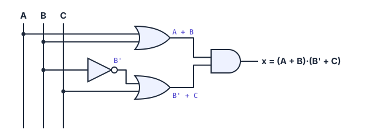
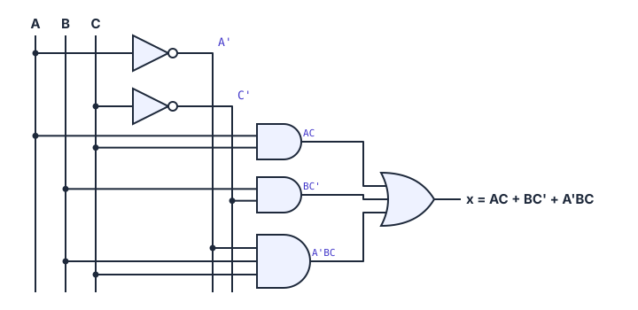
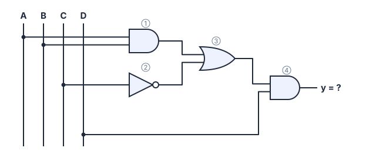

# 🔧 Circuitos combinacionais

> [← Álgebra booleana](07-algebra-booleana.md) · Próximo: [Mapa de Karnaugh →](09-mapa-de-karnaugh.md)

**Nível:** 🟡 Intermediário

> 📖 **Antes, leia:** [Álgebra booleana](07-algebra-booleana.md). Você vai precisar das portas e das tabelas-verdade de cor.

## 🎯 Você vai aprender

- A **ordem das operações** numa expressão booleana.
- Transformar uma **expressão em circuito** (de fora para dentro e de dentro para fora).
- Transformar um **circuito em expressão**, porta por porta.
- **Calcular a saída** de um circuito para valores dados.
- Montar a **tabela-verdade** com colunas intermediárias.
- Partir de uma **tabela-verdade** e chegar à expressão em **soma de produtos**.

## Em uma frase

> 💡 Expressão, circuito e tabela-verdade são **três jeitos de descrever a mesma coisa**. Esta aula ensina a passar de um para o outro.

Um circuito é **combinacional** quando a saída depende **só das entradas daquele momento** (não tem memória). Tudo o que você vê nesta aula é assim.

## 1. Ordem das operações

Igual à matemática (multiplicação antes da soma):

| Ordem | Operação | Exemplo |
| ----- | -------- | ------- |
| 1º | **Parênteses** | (A + B) |
| 2º | **NOT** | A' |
| 3º | **AND** | AB |
| 4º | **OR** | A + B |

> ⚠️ **A + BC não é (A + B)C.** Em A + BC, primeiro se faz **BC** e depois a OR com A. Para fazer a OR primeiro, precisa de parênteses.

E o NOT depende de **onde está o apóstrofo**:

| Expressão | O que inverte |
| --------- | ------------- |
| A' + B | Só o **A**, antes da OR |
| (A + B)' | O **resultado** da OR (é uma NOR) |
| A' + B' | Cada entrada separada |

## 2. Expressão → circuito

### De fora para dentro (*top-down*)

1. Ache a operação **mais externa**, a última a ser feita. Ela é a **porta da saída**.
2. Cada pedaço que entra nessa porta é uma expressão menor: repita o passo 1 para ele.
3. Continue até chegar nas **entradas** (A, B, C...). Onde houver apóstrofo, ponha um **NOT**.

**Exemplo 1: x = (A + B)(B' + C)**

| Passo | O que você vê | Porta |
| ----- | ------------- | ----- |
| 1 | Dois parênteses multiplicados: (…)·(…) | **AND** na saída |
| 2 | O primeiro parêntese é A + B | **OR** com A e B |
| 3 | O segundo é B' + C | **OR** com B' e C |
| 4 | B' | **NOT** em B |



### De dentro para fora (*bottom-up*)

1. Desenhe as entradas e, ao lado, os **NOTs** que a expressão pede.
2. Monte as portas **mais internas** (os produtos ou as somas entre parênteses).
3. Junte tudo na porta da saída.

**Exemplo 2: x = AC + BC' + A'BC**

| Passo | O que montar |
| ----- | ------------ |
| 1 | Entradas A, B, C e os inversores **A'** e **C'** |
| 2 | Três ANDs: **AC**, **BC'** e **A'BC** (esta com 3 entradas) |
| 3 | Uma **OR de 3 entradas** juntando os três produtos |



> 💡 Esse formato, várias **ANDs** alimentando uma **OR**, se chama **soma de produtos**. Ele aparece de novo no fim desta aula e no Mapa de Karnaugh.

## 3. Circuito → expressão

### 🧮 Passo a passo

1. **Numere as portas** da entrada para a saída.
2. Escreva a expressão na **saída de cada porta**, usando o que chega nela.
3. A expressão da última porta é a resposta. **Use parênteses** sempre que uma OR entrar numa AND.

**Exemplo 3:**



| Porta | Recebe | Saída |
| ----- | ------ | ----- |
| ① AND | A e B | **AB** |
| ② NOT | C | **C'** |
| ③ OR | AB e C' | **AB + C'** |
| ④ AND | (AB + C') e D | **(AB + C')·D** |

**y = (AB + C')·D**. Sem os parênteses (AB + C'D) seria **outro circuito**.

## 4. Calculando a saída

Troque cada letra pelo valor dado e resolva **na ordem das operações**.

**Exemplo 4: x = (A + B)(B' + C) com A = 0, B = 1, C = 0**

| Passo | Conta |
| ----- | ----- |
| Substituir | (0 + 1)(1' + 0) |
| NOT | (0 + 1)(0 + 0) |
| Parênteses | (1)(0) |
| AND | **x = 0** |

**Exemplo 5: y = (AB + C')·D com A = 1, B = 0, C = 0, D = 1**

(1 · 0 + 0')·1 = (0 + 1)·1 = 1 · 1 = **y = 1**

## 5. Tabela-verdade com colunas intermediárias

Para não errar, crie **uma coluna para cada pedaço** da expressão, do mais interno para o mais externo.

**Exemplo 6: x = (A + B)(B' + C)**

| A | B | C | A + B | B' | B' + C | **x** |
| - | - | - | ----- | -- | ------ | ----- |
| 0 | 0 | 0 | 0 | 1 | 1 | **0** |
| 0 | 0 | 1 | 0 | 1 | 1 | **0** |
| 0 | 1 | 0 | 1 | 0 | 0 | **0** |
| 0 | 1 | 1 | 1 | 0 | 1 | **1** |
| 1 | 0 | 0 | 1 | 1 | 1 | **1** |
| 1 | 0 | 1 | 1 | 1 | 1 | **1** |
| 1 | 1 | 0 | 1 | 0 | 0 | **0** |
| 1 | 1 | 1 | 1 | 0 | 1 | **1** |

A última coluna é a AND das colunas **A + B** e **B' + C**: só dá 1 quando as duas são 1.

> 💡 **Monte as entradas sem pensar:** a coluna C alterna 0, 1, 0, 1...; a B alterna de 2 em 2; a A de 4 em 4. É a contagem binária de 0 a 7.

## 6. Tabela-verdade → expressão (soma de produtos)

É o caminho de **projetar** um circuito: você sabe **o que** ele deve fazer e precisa descobrir a expressão.

### 🧮 Os 5 passos

1. **Entenda o problema** e monte a tabela-verdade.
2. Para **cada linha com saída 1**, escreva um **produto (AND) com todas as variáveis**: a variável que vale **0** entra **barrada**, a que vale **1** entra normal.
3. Junte todos os produtos com **OR**.
4. **Simplifique**, se der (na próxima aula você aprende o jeito rápido).
5. **Desenhe** o circuito.

**Exemplo 7: irrigação automática**

Uma horta tem três sensores:

| Sensor | Vale 1 quando... |
| ------ | ---------------- |
| **A** | é dia |
| **B** | o solo está seco |
| **C** | o tanque de água está cheio |

O irrigador (**x**) liga quando o **solo está seco** e, além disso, **é noite** (para a água não evaporar) **ou o tanque está cheio** (aí pode regar de dia).

**Passo 1: tabela-verdade**

| A | B | C | x | Produto da linha |
| - | - | - | - | ---------------- |
| 0 | 0 | 0 | 0 | |
| 0 | 0 | 1 | 0 | |
| 0 | 1 | 0 | **1** | **A'BC'** |
| 0 | 1 | 1 | **1** | **A'BC** |
| 1 | 0 | 0 | 0 | |
| 1 | 0 | 1 | 0 | |
| 1 | 1 | 0 | 0 | |
| 1 | 1 | 1 | **1** | **ABC** |

**Passos 2 e 3: soma de produtos**

```
x = A'BC' + A'BC + ABC
```

**Passo 4: simplificar.** Com as propriedades da aula anterior:

| Passo | Conta | Propriedade |
| ----- | ----- | ----------- |
| 1 | A'BC' + A'BC = A'B(C' + C) = A'B · 1 = **A'B** | C' + C = 1 |
| 2 | A'BC + ABC = BC(A' + A) = BC · 1 = **BC** | A' + A = 1 |
| 3 | **x = A'B + BC** | o A'BC foi usado duas vezes, o que pode, porque A'BC + A'BC = A'BC |

Ficou: o irrigador liga quando o solo está seco **e é noite** (A'B), **ou** quando o solo está seco **e o tanque está cheio** (BC). A próxima aula mostra como achar isso **sem álgebra**, só olhando um mapa.

**Exemplo 8: tabela de 2 variáveis**

| A | B | x |
| - | - | - |
| 0 | 0 | 1 |
| 0 | 1 | 1 |
| 1 | 0 | 0 |
| 1 | 1 | 1 |

Linhas com 1: 00 → **A'B'**; 01 → **A'B**; 11 → **AB**.

**x = A'B' + A'B + AB**, que simplificado vira **x = A' + B**.

> 📖 **Para ir além:** cada produto com todas as variáveis se chama **mintermo**. Existe também o caminho contrário, o **produto de somas** (por exemplo, (A + B' + C)(A' + C')), que usa as linhas com **0**. Nesta disciplina ele só aparece como definição.

## ⚠️ Erros comuns

| Erro | Como evitar |
| ---- | ----------- |
| Esquecer os parênteses ao escrever a expressão de um circuito | Se a saída de uma **OR** entra numa **AND**, ela vai entre parênteses |
| Fazer a OR antes da AND | AND vem **antes**: A + BC = A + (BC) |
| No produto da linha, barrar a variável que vale 1 | Barra quem vale **0** |
| Escrever o produto só com algumas variáveis | Na forma da tabela, **todo** produto tem **todas** as variáveis |
| Tabela com linhas faltando | n entradas = **2ⁿ linhas** |

## 💡 Macetes

- **Confira a soma de produtos:** substitua uma linha com 1. Exatamente um produto deve virar 1.
- **Colunas intermediárias** custam tempo, mas evitam quase todos os erros na prova.
- **Leia o circuito da direita para a esquerda** para achar a porta mais externa.

## ✅ Teste rápido

**1.** Uma porta **OR** recebe A e B, e a saída dela entra numa porta **NOT**. Qual é a expressão da saída?

<details>
<summary>Ver resposta</summary>

**Expressão:** `(A + B)'`

A OR dá **A + B**; o NOT inverte o resultado inteiro: **(A + B)'** (é uma NOR).
</details>

**2.** Calcule **x = A'B + C** para A = 1, B = 1, C = 0.

<details>
<summary>Ver resposta</summary>

**Resposta:** `0`

1' · 1 + 0 = 0 · 1 + 0 = 0 + 0 = **0**
</details>

**3.** Calcule **y = (AB + C')·D** para A = 0, B = 1, C = 0, D = 1.

<details>
<summary>Ver resposta</summary>

**Resposta:** `1`

(0 · 1 + 0')·1 = (0 + 1)·1 = **1**
</details>

**4.** Escreva a coluna de saída da tabela-verdade de **x = A + B'C**, da linha 000 até a 111 (os 8 bits juntos).

<details>
<summary>Ver resposta</summary>

**Resposta:** `01001111`

| A | B | C | B' | B'C | x |
| - | - | - | -- | --- | - |
| 0 | 0 | 0 | 1 | 0 | 0 |
| 0 | 0 | 1 | 1 | 1 | 1 |
| 0 | 1 | 0 | 0 | 0 | 0 |
| 0 | 1 | 1 | 0 | 0 | 0 |
| 1 | 0 | 0 | 1 | 0 | 1 |
| 1 | 0 | 1 | 1 | 1 | 1 |
| 1 | 1 | 0 | 0 | 0 | 1 |
| 1 | 1 | 1 | 0 | 0 | 1 |

Quando A = 1, a saída é sempre 1. Coluna: **0100 1111**.
</details>

**5.** Uma tabela-verdade de 3 variáveis só tem saída **1** nas linhas **001** e **110**. Escreva a soma de produtos.

<details>
<summary>Ver resposta</summary>

**Expressão:** `A'B'C + ABC'`

001 → A = 0, B = 0, C = 1 → **A'B'C**. 110 → A = 1, B = 1, C = 0 → **ABC'**.
</details>

**6.** Escreva a expressão do circuito do **Exemplo 1** (duas ORs ligadas numa AND), mas agora sem olhar: entradas A, B, C; uma OR recebe **A** e **B**; outra OR recebe **B'** e **C**; a AND junta as duas.

<details>
<summary>Ver resposta</summary>

**Expressão:** `(A + B)(B' + C)`

Cada OR vai entre parênteses porque as saídas delas entram numa AND.
</details>

**7.** Na expressão **A + BC**, qual operação é feita primeiro: AND ou OR?

<details>
<summary>Ver resposta</summary>

**Resposta:** `AND`

AND vem antes de OR: primeiro **BC**, depois **A + (BC)**.
</details>

## ✏️ Agora pratique

São 9 exercícios sobre este assunto, do fácil ao difícil, com resolução passo a passo:

| 🟢 Fácil | 🟡 Intermediário | 🔴 Difícil |
| -------- | ---------------- | ---------- |
| [Exercícios 01 a 03](../exercicios/08-circuitos/facil.md) | [Exercícios 04 a 06](../exercicios/08-circuitos/intermediario.md) | [Exercícios 07 a 09](../exercicios/08-circuitos/dificil.md) |

## 📚 Referências

- TOCCI, Ronald J.; WIDMER, Neal S.; MOSS, Gregory L. *Sistemas digitais: princípios e aplicações*. 11. ed. Pearson, 2011. Seções 3.6 a 3.8 e 4.1.
- [CircuitVerse](https://circuitverse.org/simulator): monte os circuitos desta aula e confira as tabelas.
