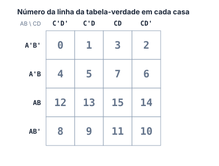
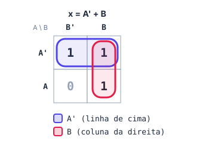
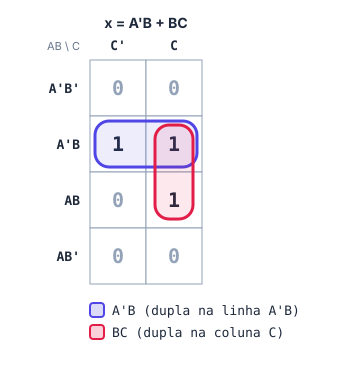
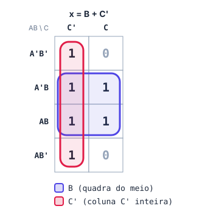
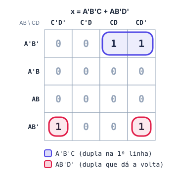
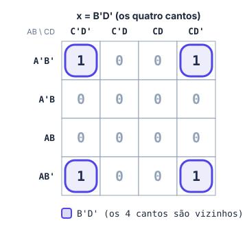
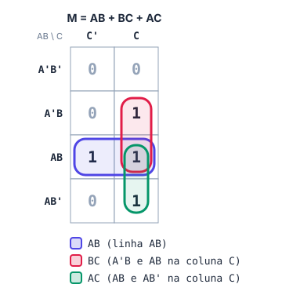
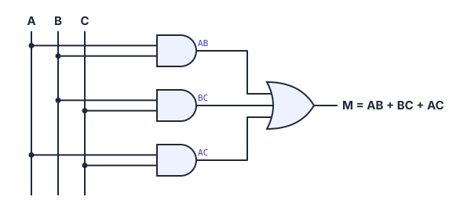

# 🗺️ Mapa de Karnaugh

> [← Circuitos combinacionais](08-circuitos-combinacionais.md) · [Voltar para Sistemas Digitais →](../README.md)

**Nível:** 🔴 Avançado

> 📖 **Antes, leia:** [Circuitos combinacionais](08-circuitos-combinacionais.md). Você vai precisar montar tabelas-verdade e escrever soma de produtos.

## 🎯 Você vai aprender

- **Por que** o mapa simplifica: a ideia de A'B + AB = B.
- Montar o mapa de **2, 3 e 4 variáveis**, na ordem certa.
- As **regras** para agrupar os 1s, incluindo grupos que **dão a volta** nas bordas.
- **Ler** cada grupo e escrever a expressão mínima.
- **Projetar** um circuito completo, do problema até as portas.

## Em uma frase

> 💡 O Mapa de Karnaugh é a tabela-verdade **desenhada como um tabuleiro**, arrumado de um jeito que **1s vizinhos podem ser juntados**. Cada grupo vira um termo curto da expressão.

## 1. A ideia por trás

Na aula anterior, x = A'B + AB virou só **B**:

```
A'B + AB = B(A' + A) = B · 1 = B
```

Isso acontece sempre que dois produtos são **iguais, menos uma variável** que aparece normal num e barrada no outro: essa variável **some**. O mapa coloca esses produtos **lado a lado**, para você enxergar a simplificação sem fazer conta.

## 2. Montando o mapa

Cada **casa** do mapa é **uma linha** da tabela-verdade. A ordem das linhas e colunas **não é a de contagem**: é uma ordem em que, de uma casa para a vizinha, **só uma letra muda**.

| Ordem | 1ª | 2ª | 3ª | 4ª |
| ----- | -- | -- | -- | -- |
| Contagem (errada aqui) | 00 | 01 | 10 | 11 |
| **Mapa (certa)** | **00** | **01** | **11** | **10** |
| Escrito com letras | A'B' | A'B | AB | AB' |

> ⚠️ **O erro número 1 do Karnaugh** é usar a ordem 00, 01, 10, 11. Repare que de 01 para 10 mudariam **duas** letras.

### Tamanhos

| Variáveis | Casas | Linhas | Colunas |
| --------- | ----- | ------ | ------- |
| 2 (A, B) | 4 | A', A | B', B |
| 3 (A, B, C) | 8 | A'B', A'B, AB, AB' | C', C |
| 4 (A, B, C, D) | 16 | A'B', A'B, AB, AB' | C'D', C'D, CD, CD' |

O número em cada casa abaixo é a **linha da tabela-verdade** que ela representa (linha 0 = 0000, linha 5 = 0101...):



> 💡 **Quem é vizinho de quem?** Casas encostadas na horizontal ou na vertical. E também: a **primeira e a última linha** são vizinhas, a **primeira e a última coluna** são vizinhas, e os **quatro cantos** são vizinhos entre si. Pense no mapa como um mapa-múndi: quem sai pela direita volta pela esquerda.

## 3. As regras dos grupos

| # | Regra |
| - | ----- |
| 1 | Só se agrupam casas com **1** |
| 2 | Todo grupo tem **1, 2, 4, 8 ou 16** casas (potências de 2) |
| 3 | O grupo é um **retângulo** (linha, coluna, quadrado). **Diagonal não vale** |
| 4 | O grupo pode **dar a volta** pelas bordas (e os 4 cantos formam um grupo) |
| 5 | Grupos **podem se sobrepor**: um 1 pode estar em mais de um grupo |
| 6 | **Todo 1** precisa estar em pelo menos um grupo |

Para chegar na expressão **mínima**:

- faça os grupos **o maior possível** (grupo maior = termo menor);
- use **o menor número de grupos** (cada grupo vira um termo);
- não crie um grupo cujos 1s já estão todos em outros grupos.

### Lendo um grupo

Olhe para as variáveis dentro do grupo:

| A variável... | No termo |
| ------------- | -------- |
| é **sempre 1** no grupo | entra **normal** (A) |
| é **sempre 0** no grupo | entra **barrada** (A') |
| **muda** dentro do grupo (aparece 0 e 1) | **sai** |

| Tamanho do grupo | Variáveis que saem |
| ---------------- | ------------------ |
| 1 casa | nenhuma |
| 2 casas | 1 |
| 4 casas | 2 |
| 8 casas | 3 |

## 🧮 Passo a passo

1. Monte a **tabela-verdade** (ou use a expressão que foi dada).
2. Desenhe o mapa na **ordem certa** e copie cada saída para a sua casa.
3. Faça os **grupos**: comece pelos 1s que só podem entrar em um grupo, e faça os grupos maiores primeiro.
4. **Leia** cada grupo e escreva o termo.
5. Junte os termos com **OR**.
6. **Confira** com uma ou duas linhas da tabela.

## 4. Exemplos resolvidos

### Exemplo 1: 2 variáveis

Tabela: 00 → 1, 01 → 1, 10 → 0, 11 → 1 (é o Exemplo 8 da aula anterior).



| Grupo | Casas | O que muda | O que fica | Termo |
| ----- | ----- | ---------- | ---------- | ----- |
| Azul | linha A' inteira | B | A = 0 | **A'** |
| Vermelho | coluna B inteira | A | B = 1 | **B** |

**x = A' + B**. O 1 da casa A'B está nos dois grupos, e tudo bem (regra 5).

### Exemplo 2: 3 variáveis (a irrigação da aula anterior)

x = A'BC' + A'BC + ABC



| Grupo | Casas | O que muda | O que fica | Termo |
| ----- | ----- | ---------- | ---------- | ----- |
| Azul | linha A'B (as duas colunas) | C | A = 0, B = 1 | **A'B** |
| Vermelho | coluna C, linhas A'B e AB | A | B = 1, C = 1 | **BC** |

**x = A'B + BC**. Mesmo resultado da álgebra, sem nenhuma conta.

### Exemplo 3: quadra e coluna inteira

Tabela de 3 variáveis com saída **1, 0, 1, 1, 1, 0, 1, 1** (linhas 000 a 111).



| Grupo | Casas | O que muda | O que fica | Termo |
| ----- | ----- | ---------- | ---------- | ----- |
| Azul (4 casas) | linhas A'B e AB, as duas colunas | A e C | B = 1 | **B** |
| Vermelho (4 casas) | coluna C' inteira | A e B | C = 0 | **C'** |

**x = B + C'**. Dois grupos de 4: cada um elimina **duas** variáveis.

### Exemplo 4: 4 variáveis, grupo que dá a volta



| Grupo | Casas | O que muda | O que fica | Termo |
| ----- | ----- | ---------- | ---------- | ----- |
| Azul | linha A'B', colunas CD e CD' | D | A = 0, B = 0, C = 1 | **A'B'C** |
| Vermelho | linha AB', colunas C'D' e CD' (pela borda) | C | A = 1, B = 0, D = 0 | **AB'D'** |

**x = A'B'C + AB'D'**. O grupo vermelho parece separado, mas a primeira e a última coluna são **vizinhas** (regra 4).

### Exemplo 5: os quatro cantos



Os cantos são A'B'C'D', A'B'CD', AB'C'D' e AB'CD'. Mudam **A** e **C**; ficam **B = 0** e **D = 0**.

**x = B'D'**. Sem o mapa, seriam quatro produtos de 4 letras cada.

> 💡 **Mais de uma resposta certa:** às vezes dá para fazer grupos diferentes do mesmo tamanho e chegar em expressões diferentes, **com o mesmo número de termos e letras**. As duas estão certas. (O corretor do site aceita qualquer uma que seja equivalente e mínima.)

## 5. Projeto completo: votação por maioria

**Problema:** três jurados (A, B e C) apertam um botão para aprovar (1) ou reprovar (0) um projeto. A luz **M** acende quando **pelo menos dois** aprovam.

**Passo 1: tabela-verdade**

| A | B | C | M |
| - | - | - | - |
| 0 | 0 | 0 | 0 |
| 0 | 0 | 1 | 0 |
| 0 | 1 | 0 | 0 |
| 0 | 1 | 1 | **1** |
| 1 | 0 | 0 | 0 |
| 1 | 0 | 1 | **1** |
| 1 | 1 | 0 | **1** |
| 1 | 1 | 1 | **1** |

Sem simplificar: M = A'BC + AB'C + ABC' + ABC (4 produtos de 3 letras: 12 letras).

**Passos 2 a 4: mapa e grupos**



| Grupo | Casas | O que fica | Termo |
| ----- | ----- | ---------- | ----- |
| Azul | linha AB | A = 1, B = 1 | **AB** |
| Vermelho | coluna C, linhas A'B e AB | B = 1, C = 1 | **BC** |
| Verde | coluna C, linhas AB e AB' | A = 1, C = 1 | **AC** |

O 1 da casa ABC entra nos três grupos, e isso é permitido.

**Passo 5: expressão e circuito**

**M = AB + BC + AC** (3 produtos de 2 letras: 6 letras, metade do original).



**Conferindo:** com A = 1, B = 0, C = 1 (dois aprovaram): AB = 0, BC = 0, AC = 1, então M = 1 ✔

## ⚠️ Erros comuns

| Erro | Como evitar |
| ---- | ----------- |
| Ordem 00, 01, 10, 11 nas linhas | A ordem do mapa é **00, 01, 11, 10** |
| Grupo de 3 ou de 6 casas | Só **1, 2, 4, 8, 16** |
| Grupo em diagonal | Só retângulos (linhas, colunas, quadrados) |
| Esquecer que as bordas se tocam | Primeira e última linha (e coluna) são **vizinhas** |
| Grupos pequenos demais | Sempre tente o **maior** grupo possível para cada 1 |
| Deixar um 1 sozinho sem grupo | Todo 1 precisa estar em algum grupo (nem que seja de 1 casa) |
| Manter no termo a variável que muda | Se ela aparece **0 e 1** dentro do grupo, ela **sai** |

## 💡 Macetes

- **Grupo de 2 tira 1 letra, grupo de 4 tira 2, grupo de 8 tira 3.** Num mapa de 3 variáveis, um grupo de 4 vira um termo de **1 letra**.
- **Comece pelos 1s "difíceis"**, os que só têm um jeito de serem agrupados.
- **Confira o resultado** substituindo uma linha da tabela com saída 0: a expressão também tem que dar 0.

## ✅ Teste rápido

Nas perguntas abaixo, escreva a expressão **mínima**. O corretor avisa se a sua for equivalente, mas ainda der para simplificar.

**1.** Mapa de 2 variáveis com 1 nas casas **A'B** e **AB** (e 0 nas outras).

<details>
<summary>Ver resposta</summary>

**Expressão mínima:** `B`

As duas casas formam a coluna B inteira: A muda e some. Sobra **B**.
</details>

**2.** Mapa de 3 variáveis com 1 nas linhas **000, 001, 100 e 101** da tabela (e 0 nas outras).

<details>
<summary>Ver resposta</summary>

**Expressão mínima:** `B'`

No mapa, essas casas são as linhas **A'B'** e **AB'** inteiras, que são vizinhas pela borda. É um grupo de 4: saem A e C, fica **B = 0**, ou seja, **B'**.
</details>

**3.** Mapa de 3 variáveis com 1 só nas linhas **010** e **110**.

<details>
<summary>Ver resposta</summary>

**Expressão mínima:** `BC'`

As casas A'BC' e ABC' estão na coluna C', nas linhas A'B e AB (vizinhas). A muda e sai: **BC'**.
</details>

**4.** Mapa de 4 variáveis com 1 só nas linhas **0000, 0010, 1000 e 1010**.

<details>
<summary>Ver resposta</summary>

**Expressão mínima:** `B'D'`

São os **quatro cantos** do mapa (como no Exemplo 5): **B'D'**.
</details>

**5.** Mapa de 4 variáveis com 1 só nas linhas **0101, 0111, 1101 e 1111**.

<details>
<summary>Ver resposta</summary>

**Expressão mínima:** `BD`

As casas ficam no **centro** do mapa: linhas A'B e AB, colunas C'D e CD. Mudam A e C; ficam **B = 1** e **D = 1**: **BD**.
</details>

**6.** Tabela de 3 variáveis com saída **1** nas linhas **000, 001, 011 e 111** (e 0 nas outras).

<details>
<summary>Ver resposta</summary>

**Expressão mínima:** `A'B' + BC`

| Grupo | Casas | Termo |
| ----- | ----- | ----- |
| 1 | linha A'B' (000 e 001) | **A'B'** |
| 2 | coluna C, linhas A'B e AB (011 e 111) | **BC** |

**x = A'B' + BC**
</details>

**7.** Um cofre tem três sensores (A, B, C). O alarme dispara quando **pelo menos dois** sensores detectam algo. Escreva a expressão mínima do alarme.

<details>
<summary>Ver resposta</summary>

**Expressão mínima:** `AB + BC + AC`

É o mesmo problema da maioria (seção 5): **AB + BC + AC**.
</details>

**8.** Mapa de 4 variáveis com 1 em **todas as casas** das linhas **A'B'** e **AB'** (8 casas) e 0 no resto.

<details>
<summary>Ver resposta</summary>

**Expressão mínima:** `B'`

As linhas A'B' e AB' são vizinhas pela borda e formam um grupo de **8**: saem A, C e D. Fica **B'**.
</details>

## ✏️ Agora pratique

São 9 exercícios sobre este assunto, do fácil ao difícil, com resolução passo a passo:

| 🟢 Fácil | 🟡 Intermediário | 🔴 Difícil |
| -------- | ---------------- | ---------- |
| [Exercícios 01 a 03](../exercicios/09-karnaugh/facil.md) | [Exercícios 04 a 06](../exercicios/09-karnaugh/intermediario.md) | [Exercícios 07 a 09](../exercicios/09-karnaugh/dificil.md) |

## 📖 Para ir além (fora da ementa)

- **Don't care (X):** às vezes uma combinação de entradas nunca acontece. Essa casa pode ser tratada como 0 ou 1, o que for melhor para fazer grupos maiores.
- Com **5 ou mais variáveis** o mapa fica difícil de desenhar; aí se usam métodos de computador, como o de **Quine-McCluskey**.

## 📚 Referências

- TOCCI, Ronald J.; WIDMER, Neal S.; MOSS, Gregory L. *Sistemas digitais: princípios e aplicações*. 11. ed. Pearson, 2011. Seções 4.1 a 4.5.
- [CircuitVerse](https://circuitverse.org/simulator): monte o circuito da maioria e teste as 8 combinações.
