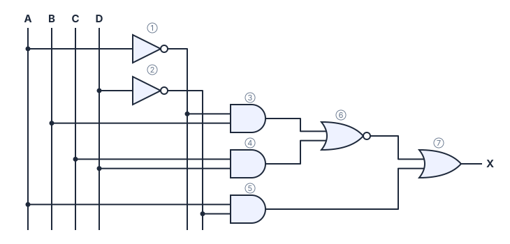

# 📝 Simulado 03 · Sistemas Digitais

> [← voltar para Simulados](../../README.md)

**Nível:** 🔴 Avançado

**Duração sugerida:** 1h30 · **Pontuação:** 100 pontos · **Assuntos:** todos (aulas 1 a 9)

> ⚠️ **Regras da prova:**
>
> - Individual e **sem consulta**: nada de internet, anotações, calculadora ou IA.
> - A única consulta permitida é a **tabela ASCII** (está na [aula de Codificação](../../../conteudo/sistemas-digitais/aulas/04-codificacao.md)).
> - **Mostre as contas** no papel: resposta sem desenvolvimento vale metade.
> - As questões 01 a 08 valem **8 pontos** e as 09 a 12 valem **9**. Os itens de uma questão valem partes iguais.
> - Só confira as respostas depois que o tempo acabar.

> 💡 **Corrigindo no site:** cada item tem um campo para digitar a sua resposta e conferir na hora. Use só na correção, depois do tempo. Itens abertos (de explicar) não têm campo: compare com a resposta esperada.

---

## Questão 01 · Analógico e digital · 8 pontos

**Ruído e decisão de bits.** Um cabo transmite bits usando **0 V** para o 0 e **5 V** para o 1. O receptor decide: abaixo de **2,5 V** é 0; a partir de 2,5 V é 1. Por causa do ruído, ele mediu, em sequência (o primeiro é o MSB): 4,3 V · 0,6 V · 5,7 V · 0,9 V · 3,9 V.

**a)** Qual sequência de bits foi recebida?

<details>
<summary>Ver resposta</summary>

**Resposta:** `10101`

| Tensão (V) | 4,3 | 0,6 | 5,7 | 0,9 | 3,9 |
| ---------- | --- | --- | --- | --- | --- |
| Bit | 1 | 0 | 1 | 0 | 1 |

**10101**
</details>

**b)** Que número decimal ela representa?

<details>
<summary>Ver resposta</summary>

**Resposta:** `21`

16 + 4 + 1 = **21**
</details>

**c)** Se o mesmo ruído atingisse um sinal **analógico** que representasse diretamente uma temperatura (1 V = 10 °C), o que aconteceria? Relacione com a vantagem "menos afetado por ruído".

<details>
<summary>Ver resposta</summary>

**Resposta esperada:** no analógico, **cada variação de tensão é informação**: 4,3 V em vez de 5 V viraria 43 °C em vez de 50 °C, e não existe como saber que houve erro. No digital, o receptor só precisa decidir "acima ou abaixo de 2,5 V": ruídos menores que a margem não mudam nenhum bit. Por isso sistemas digitais são **menos afetados por ruído**.
</details>

---

## Questão 02 · Binário · 8 pontos

**Registrador de ponto fixo 4.4.** Um processador de áudio guarda ganhos num registrador de **8 bits**: **4 bits antes da vírgula e 4 depois** (formato "4.4"). Exemplo de conteúdo: **1011,0110₂**.

**a)** Qual é o valor decimal do exemplo?

<details>
<summary>Ver resposta</summary>

**Resposta:** `11,375`

| Peso | 8 | 4 | 2 | 1 | , | 0,5 | 0,25 | 0,125 | 0,0625 |
| ---- | - | - | - | - | - | --- | ---- | ----- | ------ |
| Bit | 1 | 0 | 1 | 1 | , | 0 | 1 | 1 | 0 |

8 + 2 + 1 + 0,25 + 0,125 = **11,375**
</details>

**b)** Qual é o **maior** valor representável?

<details>
<summary>Ver resposta</summary>

**Resposta:** `15,9375`

1111,1111₂ = 8 + 4 + 2 + 1 + 0,5 + 0,25 + 0,125 + 0,0625 = **15,9375**
</details>

**c)** Qual é o **menor passo** entre dois valores vizinhos?

<details>
<summary>Ver resposta</summary>

**Resposta:** `0,0625`

É o peso do último bit: 2⁻⁴ = **0,0625**.
</details>

**d)** Quantos valores diferentes o registrador representa?

<details>
<summary>Ver resposta</summary>

**Resposta:** `256`

São 8 bits no total: 2⁸ = **256** (de 0 a 15,9375, de 0,0625 em 0,0625).
</details>

---

## Questão 03 · Decimal para binário · 8 pontos

**Precisão limitada.** Um sensor de umidade envia **37,3 %** para uma placa que só aceita números binários com **4 bits depois da vírgula**.

**a)** Converta 37,3 para binário com 4 bits depois da vírgula.

<details>
<summary>Ver resposta</summary>

**Resposta:** `100101,0100`

37 = 32 + 4 + 1 = **100101₂**.

| Conta | Resultado | Bit |
| ----- | --------- | --- |
| 0,3 × 2 | 0,6 | **0** |
| 0,6 × 2 | 1,2 | **1** |
| 0,2 × 2 | 0,4 | **0** |
| 0,4 × 2 | 0,8 | **0** |

**100101,0100₂** (a conta não terminou: os bits que não cabem são descartados).
</details>

**b)** Qual valor decimal a placa realmente recebe?

<details>
<summary>Ver resposta</summary>

**Resposta:** `37,25`

100101,0100₂ = 37 + 0,25 = **37,25**
</details>

**c)** Qual é o erro?

<details>
<summary>Ver resposta</summary>

**Resposta:** `0,05`

37,3 − 37,25 = **0,05**
</details>

**d)** Com **6 bits** depois da vírgula, qual seria o valor recebido?

<details>
<summary>Ver resposta</summary>

**Resposta:** `37,296875`

| Conta | Resultado | Bit |
| ----- | --------- | --- |
| 0,3 × 2 | 0,6 | **0** |
| 0,6 × 2 | 1,2 | **1** |
| 0,2 × 2 | 0,4 | **0** |
| 0,4 × 2 | 0,8 | **0** |
| 0,8 × 2 | 1,6 | **1** |
| 0,6 × 2 | 1,2 | **1** |

0,010011₂ = 0,25 + 0,03125 + 0,015625 = 0,296875. Valor: **37,296875**
</details>

**e)** E o novo erro?

<details>
<summary>Ver resposta</summary>

**Resposta:** `0,003125`

37,3 − 37,296875 = **0,003125**, mais de 15 vezes menor. **Mais bits na fração = mais precisão** (e mais memória).
</details>

---

## Questão 04 · Hexadecimal · 8 pontos

**Passos de um motor.** Um sistema guarda a quantidade de passos de um motor, **7 654**, num registrador de **16 bits**. O engenheiro quer ver o valor em hexa e em binário.

**a)** Converta 7 654 para hexadecimal.

<details>
<summary>Ver resposta</summary>

**Resposta:** `1DE6`

| Divisão | Quociente | Resto |
| ------- | --------- | ----- |
| 7 654 ÷ 16 | 478 | 6 → **6** |
| 478 ÷ 16 | 29 | 14 → **E** |
| 29 ÷ 16 | 1 | 13 → **D** |
| 1 ÷ 16 | 0 | 1 → **1** |

De baixo para cima: **0x1DE6**
</details>

**b)** Converta o resultado para binário com 16 bits.

<details>
<summary>Ver resposta</summary>

**Resposta:** `0001 1101 1110 0110`

Cada algarismo vira 4 bits: 1 → 0001, D → 1101, E → 1110, 6 → 0110.

**0001 1101 1110 0110**

Conferindo: 1 × 4 096 + 13 × 256 + 14 × 16 + 6 = 4 096 + 3 328 + 224 + 6 = 7 654 ✔
</details>

---

## Questão 05 · Codificação · 8 pontos

**Tamanho de uma imagem.** Uma câmera de segurança captura imagens de **640 × 480** pixels, sem compressão, em três modos possíveis. Dê o tamanho de uma imagem em cada modo (1 KB = 1 024 bytes).

**a)** Preto e branco (1 bit por pixel), em **bytes**:

<details>
<summary>Ver resposta</summary>

**Resposta:** `38400`

640 × 480 = 307 200 pixels × 1 bit = 307 200 bits ÷ 8 = **38 400 bytes**
</details>

**b)** Preto e branco, em **KB**:

<details>
<summary>Ver resposta</summary>

**Resposta:** `37,5`

38 400 ÷ 1 024 = **37,5 KB**
</details>

**c)** Tons de cinza (8 bits por pixel), em **bytes**:

<details>
<summary>Ver resposta</summary>

**Resposta:** `307200`

1 byte por pixel: **307 200 bytes** (= 300 KB)
</details>

**d)** RGB (24 bits por pixel), em **KB**:

<details>
<summary>Ver resposta</summary>

**Resposta:** `900`

3 bytes por pixel: 921 600 bytes ÷ 1 024 = **900 KB**
</details>

---

## Questão 06 · Adição binária · 8 pontos

**Soma de bytes.** Um processador de 8 bits soma dois bytes lidos da memória: **1100 1011₂** e **0110 0111₂**. O resultado vai para um registrador de **16 bits** (não há perda).

**a)** Qual é a soma em binário?

<details>
<summary>Ver resposta</summary>

**Resposta:** `100110010`

```
Vai um:  1 1     1 1 1 1
           1 1 0 0 1 0 1 1
        +  0 1 1 0 0 1 1 1
         -----------------
         1 0 0 1 1 0 0 1 0
```

**1 0011 0010₂**
</details>

**b)** Quanto vale em decimal?

<details>
<summary>Ver resposta</summary>

**Resposta:** `306`

203 + 103 = **306** ✔ (precisou de 9 bits; por isso o registrador de 16 bits).
</details>

---

## Questão 07 · Números negativos · 8 pontos

**10 bits: é possível?.** Um sistema de controle usa **10 bits** para representar correções de posição.

**a)** Escreva +300 com 10 bits.

<details>
<summary>Ver resposta</summary>

**Resposta:** `0100101100`

300 = 256 + 32 + 8 + 4 = **0100101100** (o mesmo nas três representações).
</details>

**b)** −300 em sinal-magnitude:

<details>
<summary>Ver resposta</summary>

**Resposta:** `1100101100`

Troca o MSB: **1100101100**
</details>

**c)** −300 em complemento a 1:

<details>
<summary>Ver resposta</summary>

**Resposta:** `1011010011`

Inverte tudo: **1011010011**
</details>

**d)** −300 em complemento a 2:

<details>
<summary>Ver resposta</summary>

**Resposta:** `1011010100`

C1 + 1: **1011010100**
</details>

**e)** Alguma das três representações consegue guardar **+512** com 10 bits? (sim ou não)

<details>
<summary>Ver resposta</summary>

**Resposta:** `não`

**Não.** Nas três, o maior positivo com 10 bits é 2⁹ − 1 = **511**.
</details>

**f)** Qual das três consegue guardar **−512**? (SM, C1 ou C2)

<details>
<summary>Ver resposta</summary>

**Resposta:** `C2 | complemento a 2`

Só o **C2**: a faixa dele vai de −2⁹ = **−512** até 511. Em SM e C1 a faixa é −511 a 511, por causa do "−0".
</details>

---

## Questão 08 · Overflow · 8 pontos

**Overflow com 6 bits.** Um microcontrolador de **6 bits** (C2) calcula **−20 − 15**.

**a)** Qual é o resultado nos 6 bits?

<details>
<summary>Ver resposta</summary>

**Resposta:** `011101`

−20 = 101100 (20 = 010100) e −15 = 110001 (15 = 001111).

```
Vai um:  1
           1 0 1 1 0 0     (−20)
        +  1 1 0 0 0 1     (−15)
         -------------
         1 0 1 1 1 0 1
```

Descartando o vai um: **011101** (vale 29).
</details>

**b)** Houve overflow? (sim ou não)

<details>
<summary>Ver resposta</summary>

**Resposta:** `sim`

Negativo + negativo deu **positivo** (+29): **sim**. O certo seria −35, e a faixa com 6 bits é −32 a 31.
</details>

**c)** Com quantos bits, no mínimo, a conta daria certo?

<details>
<summary>Ver resposta</summary>

**Resposta:** `7`

Com 7 bits a faixa é −64 a 63, e −35 cabe: **7 bits**.
</details>

---

## Questão 09 · Álgebra booleana · 9 pontos

**Ventoinha do rack.** A ventoinha de um rack de servidores (**F = 1** liga) segue as regras:

- liga se a **temperatura estiver alta (T = 1)** e o **servidor estiver ligado (S = 1)**;
- também liga se o operador acionar o **modo manual (M = 1)**;
- mas **nunca** liga se o **modo manutenção (K = 1)** estiver ativo.

**a)** Escreva a expressão de F.

<details>
<summary>Ver resposta</summary>

**Expressão:** `(TS + M)K'`

"(T **e** S) **ou** M" = TS + M. "Mas nunca com K" = AND com **K'** do **resultado todo**: **F = (TS + M)K'**. Sem os parênteses (TS + MK') a manutenção não bloquearia o T·S.
</details>

**b)** F para (T, S, M, K) = (1, 1, 0, 0):

<details>
<summary>Ver resposta</summary>

**Resposta:** `1`

(TS + M)K' = (1·1 + 0)·1 = **1**
</details>

**c)** F para (T, S, M, K) = (1, 0, 0, 0):

<details>
<summary>Ver resposta</summary>

**Resposta:** `0`

(TS + M)K' = (1·0 + 0)·1 = **0**
</details>

**d)** F para (T, S, M, K) = (0, 0, 1, 0):

<details>
<summary>Ver resposta</summary>

**Resposta:** `1`

(TS + M)K' = (0·0 + 1)·1 = **1**
</details>

**e)** F para (T, S, M, K) = (1, 1, 1, 1):

<details>
<summary>Ver resposta</summary>

**Resposta:** `0`

(TS + M)K' = (1·1 + 1)·0 = **0**
</details>

**f)** Em quantas das 16 combinações a ventoinha liga?

<details>
<summary>Ver resposta</summary>

**Resposta:** `5`

| T | S | M | K | TS + M | **F** |
| - | - | - | - | ------ | ----- |
| 0 | 0 | 0 | 0 | 0 | **0** |
| 0 | 0 | 0 | 1 | 0 | **0** |
| 0 | 0 | 1 | 0 | 1 | **1** |
| 0 | 0 | 1 | 1 | 1 | **0** |
| 0 | 1 | 0 | 0 | 0 | **0** |
| 0 | 1 | 0 | 1 | 0 | **0** |
| 0 | 1 | 1 | 0 | 1 | **1** |
| 0 | 1 | 1 | 1 | 1 | **0** |
| 1 | 0 | 0 | 0 | 0 | **0** |
| 1 | 0 | 0 | 1 | 0 | **0** |
| 1 | 0 | 1 | 0 | 1 | **1** |
| 1 | 0 | 1 | 1 | 1 | **0** |
| 1 | 1 | 0 | 0 | 1 | **1** |
| 1 | 1 | 0 | 1 | 1 | **0** |
| 1 | 1 | 1 | 0 | 1 | **1** |
| 1 | 1 | 1 | 1 | 1 | **0** |

**5** combinações (todas com K = 0).
</details>

---

## Questão 10 · Circuitos combinacionais · 9 pontos

**Circuito do firewall.** Um firewall decide se um pacote é **bloqueado (X = 1)** usando o circuito abaixo.



**a)** Escreva a expressão de X.

<details>
<summary>Ver resposta</summary>

**Expressão:** `(A'B + CD)' + AD'`

| Porta | Recebe | Saída |
| ----- | ------ | ----- |
| ① NOT | A | A' |
| ② NOT | D | D' |
| ③ AND | A' e B | A'B |
| ④ AND | C e D | CD |
| ⑤ AND | A e D' | AD' |
| ⑥ NOR | A'B e CD | (A'B + CD)' |
| ⑦ OR | ⑥ e ⑤ | **(A'B + CD)' + AD'** |
</details>

**b)** Calcule X para (A, B, C, D) = (1, 0, 1, 0).

<details>
<summary>Ver resposta</summary>

**Resposta:** `1`

A'B = 0·0 = 0; CD = 1·0 = 0; NOR(0, 0) = 1; AD' = 1·1 = 1; X = 1 + 1 = **1**
</details>

**c)** Calcule X para (A, B, C, D) = (0, 1, 1, 1).

<details>
<summary>Ver resposta</summary>

**Resposta:** `0`

A'B = 1·1 = 1; CD = 1; NOR(1, 1) = 0; AD' = 0·0 = 0; X = 0 + 0 = **0**
</details>

**d)** Quantas portas o circuito usa no total?

<details>
<summary>Ver resposta</summary>

**Resposta:** `7`

2 NOT + 3 AND + 1 NOR + 1 OR = **7** portas.
</details>

---

## Questão 11 · Soma de produtos · 9 pontos

**Aprovação de deploy.** Uma atualização só vai para produção (**X = 1**) se o **Tech Lead aprovar (L = 1)** **e** a **maioria** dos três revisores (A, B, C) também aprovar. Sem o Tech Lead, nada é publicado.

**a)** Monte a tabela-verdade (16 linhas, ordem L, A, B, C). Em quantas linhas X = 1?

<details>
<summary>Ver resposta</summary>

**Resposta:** `4`

| L | A | B | C | **X** |
| - | - | - | - | ----- |
| 0 | 0 | 0 | 0 | **0** |
| 0 | 0 | 0 | 1 | **0** |
| 0 | 0 | 1 | 0 | **0** |
| 0 | 0 | 1 | 1 | **0** |
| 0 | 1 | 0 | 0 | **0** |
| 0 | 1 | 0 | 1 | **0** |
| 0 | 1 | 1 | 0 | **0** |
| 0 | 1 | 1 | 1 | **0** |
| 1 | 0 | 0 | 0 | **0** |
| 1 | 0 | 0 | 1 | **0** |
| 1 | 0 | 1 | 0 | **0** |
| 1 | 0 | 1 | 1 | **1** |
| 1 | 1 | 0 | 0 | **0** |
| 1 | 1 | 0 | 1 | **1** |
| 1 | 1 | 1 | 0 | **1** |
| 1 | 1 | 1 | 1 | **1** |

Só com L = 1 e pelo menos dois revisores: **4** linhas (1011, 1101, 1110, 1111).
</details>

**b)** Escreva X em soma de produtos canônica.

<details>
<summary>Ver resposta</summary>

**Expressão:** `LA'BC + LAB'C + LABC' + LABC`

**X = LA'BC + LAB'C + LABC' + LABC**
</details>

**c)** Simplifique.

<details>
<summary>Ver resposta</summary>

**Expressão mínima:** `LAB + LAC + LBC`

Com L em evidência: X = L(A'BC + AB'C + ABC' + ABC). O parêntese é a **maioria de 3**, que simplifica para AB + AC + BC (veja a aula de Karnaugh). Distribuindo o L: **X = LAB + LAC + LBC**.
</details>

---

## Questão 12 · Mapa de Karnaugh · 9 pontos

**Comparador de 2 bits.** Um comparador recebe dois números de 2 bits, **N1 = AB** e **N2 = CD**, e dá **Y = 1** quando **N1 > N2**. Na forma canônica, Y tem 6 produtos (linhas 4, 8, 9, 12, 13, 14).

**a)** Simplifique Y pelo Mapa de Karnaugh.

<details>
<summary>Ver resposta</summary>

**Expressão mínima:** `AC' + BC'D' + ABD'`

| AB \ CD | **C'D'** | **C'D** | **CD** | **CD'** |
| ------- | -------- | ------- | ------ | ------- |
| **A'B'** | 0 | 0 | 0 | 0 |
| **A'B** | **1** | 0 | 0 | 0 |
| **AB** | **1** | **1** | 0 | **1** |
| **AB'** | **1** | **1** | 0 | 0 |

| Grupo | Casas | Termo |
| ----- | ----- | ----- |
| 1 | linhas AB e AB', colunas C'D' e C'D (8, 9, 12, 13) | **AC'** |
| 2 | coluna C'D', linhas A'B e AB (4, 12) | **BC'D'** |
| 3 | linha AB, colunas C'D' e CD' (12, 14; pela borda) | **ABD'** |

**Y = AC' + BC'D' + ABD'**
</details>

**b)** Interprete cada termo.

<details>
<summary>Ver resposta</summary>

**Resposta esperada:**

- **AC'**: o bit alto de N1 é 1 e o de N2 é 0, então N1 ≥ 2 > N2.
- **BC'D'**: N2 = 00 (zero) e N1 tem B = 1, então N1 ≥ 1 > 0.
- **ABD'**: N1 = 11 (3) e N2 é par (0 ou 2), então 3 > N2.
</details>

**c)** Quantos produtos a expressão tinha antes e quantos tem depois? Responda o número de **depois**.

<details>
<summary>Ver resposta</summary>

**Resposta:** `3`

Antes: 6 produtos de 4 letras (24 letras). Depois: **3** produtos (2 + 3 + 3 = 8 letras). Bem menos portas.
</details>
