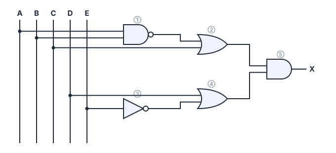

# 📝 Simulado 04 · Sistemas Digitais

> [← voltar para Simulados](../../README.md)

**Nível:** 🔴 Avançado

**Duração sugerida:** 1h30 · **Pontuação:** 100 pontos · **Assuntos:** todos (aulas 1 a 9)

> ⚠️ **Regras da prova:**
>
> - Individual e **sem consulta**: nada de internet, anotações, calculadora ou IA.
> - A única consulta permitida é a **tabela ASCII** (está na [aula de Codificação](../../../conteudo/sistemas-digitais/aulas/04-codificacao.md)).
> - **Mostre as contas** no papel: resposta sem desenvolvimento vale metade.
> - As questões 01 a 08 valem **8 pontos** e as 09 a 12 valem **9**. Os itens de uma questão valem partes iguais.
> - Só confira as respostas depois que o tempo acabar.

> 💡 **Corrigindo no site:** cada item tem um campo para digitar a sua resposta e conferir na hora. Use só na correção, depois do tempo. Itens abertos (de explicar) não têm campo: compare com a resposta esperada.

---

## Questão 01 · Analógico e digital · 8 pontos

**Um byte pelo fio.** Um microcontrolador de 3,3 V envia bits por um fio: **0 V = 0** e **3,3 V = 1**. O receptor decide: a partir de **1,65 V** é 1; abaixo disso, 0. Com ruído, mediu (o primeiro é o MSB): 0,4 · 3,1 · 0,2 · 0,9 · 2,8 · 0,6 · 3,6 · 2,2 (em volts).

**a)** Qual byte foi recebido?

<details>
<summary>Ver resposta</summary>

**Resposta:** `0100 1011`

| Tensão (V) | 0,4 | 3,1 | 0,2 | 0,9 | 2,8 | 0,6 | 3,6 | 2,2 |
| ---------- | --- | --- | --- | --- | --- | --- | --- | --- |
| Bit | 0 | 1 | 0 | 0 | 1 | 0 | 1 | 1 |

**0100 1011**
</details>

**b)** Quanto vale em decimal?

<details>
<summary>Ver resposta</summary>

**Resposta:** `75`

64 + 8 + 2 + 1 = **75**
</details>

**c)** E em hexadecimal?

<details>
<summary>Ver resposta</summary>

**Resposta:** `4B`

0100 1011 → **0x4B**
</details>

**d)** Se o byte for um caractere ASCII, qual caractere foi enviado?

<details>
<summary>Ver resposta</summary>

**Resposta:** `K`

0x4B → linha 4, coluna B → **K**
</details>

---

## Questão 02 · Binário · 8 pontos

**Pacote com dois campos.** Uma estação meteorológica envia uma palavra de **16 bits**: os **8 mais significativos** são a temperatura (°C) e os **8 menos significativos** são a umidade (%). Palavra recebida: **0001 1001 0100 0110**.

**a)** Qual é a temperatura?

<details>
<summary>Ver resposta</summary>

**Resposta:** `25`

0001 1001 = 16 + 8 + 1 = **25 °C**
</details>

**b)** Qual é a umidade?

<details>
<summary>Ver resposta</summary>

**Resposta:** `70`

0100 0110 = 64 + 4 + 2 = **70 %**
</details>

**c)** Qual seria o valor se a palavra inteira fosse lida (por engano) como um único número de 16 bits?

<details>
<summary>Ver resposta</summary>

**Resposta:** `6470`

0x1946 = 1 × 4 096 + 9 × 256 + 4 × 16 + 6 = **6 470**. (Também dá 25 × 256 + 70.)
</details>

---

## Questão 03 · Decimal para binário · 8 pontos

**Quantos bits de precisão?.** Um medidor envia a nota **99,9** para uma placa que trabalha com binário de vírgula fixa (os bits que não cabem são descartados).

**a)** Converta 99,9 usando 4 bits depois da vírgula.

<details>
<summary>Ver resposta</summary>

**Resposta:** `1100011,1110`

99 = 64 + 32 + 2 + 1 = **1100011₂**.

| Conta | Resultado | Bit |
| ----- | --------- | --- |
| 0,9 × 2 | 1,8 | **1** |
| 0,8 × 2 | 1,6 | **1** |
| 0,6 × 2 | 1,2 | **1** |
| 0,2 × 2 | 0,4 | **0** |

**1100011,1110₂**
</details>

**b)** Qual valor a placa recebe?

<details>
<summary>Ver resposta</summary>

**Resposta:** `99,875`

0,1110₂ = 0,5 + 0,25 + 0,125 = 0,875. Valor: **99,875**
</details>

**c)** Qual é o erro?

<details>
<summary>Ver resposta</summary>

**Resposta:** `0,025`

99,9 − 99,875 = **0,025**
</details>

**d)** Qual é o **menor** número de bits depois da vírgula para o erro ficar **abaixo de 0,01**?

<details>
<summary>Ver resposta</summary>

**Resposta:** `6`

| Bits | 0,9 vira | Erro |
| ---- | -------- | ---- |
| 1 | 0,5 | 0,4 |
| 2 | 0,75 | 0,15 |
| 3 | 0,875 | 0,025 |
| 4 | 0,875 | 0,025 |
| 5 | 0,875 | 0,025 |
| 6 | 0,890625 | 0,009375 |
| 7 | 0,8984375 | 0,001563 |

O primeiro erro abaixo de 0,01 aparece com **6 bits**.
</details>

---

## Questão 04 · Hexadecimal · 8 pontos

**Moedas do jogo.** Um jogo guarda a quantidade de moedas do jogador num registrador de 16 bits: **0x6A5F**.

**a)** Converta para decimal.

<details>
<summary>Ver resposta</summary>

**Resposta:** `27231`

| Peso | 4 096 | 256 | 16 | 1 |
| ---- | ----- | --- | -- | - |
| Algarismo | 6 | A = 10 | 5 | F = 15 |
| Valor | 24 576 | 2 560 | 80 | 15 |

24 576 + 2 560 + 80 + 15 = **27 231**
</details>

**b)** Converta para binário.

<details>
<summary>Ver resposta</summary>

**Resposta:** `0110 1010 0101 1111`

6 → 0110, A → 1010, 5 → 0101, F → 1111: **0110 1010 0101 1111**
</details>

**c)** Quantas moedas faltam para o registrador chegar ao máximo (0xFFFF)?

<details>
<summary>Ver resposta</summary>

**Resposta:** `38304`

0xFFFF = 65 535. 65 535 − 27 231 = **38 304**
</details>

---

## Questão 05 · Codificação · 8 pontos

**Vídeo sem compressão.** Uma câmera grava vídeo **1280 × 720** (HD), cor **RGB de 24 bits**, **30 quadros por segundo**, sem compressão.

**a)** Quantos bytes ocupa **um quadro**?

<details>
<summary>Ver resposta</summary>

**Resposta:** `2764800`

1280 × 720 = 921 600 pixels × 3 bytes = **2 764 800 bytes**
</details>

**b)** Quanto é isso em KB?

<details>
<summary>Ver resposta</summary>

**Resposta:** `2 700`

2 764 800 ÷ 1 024 = **2 700 KB**
</details>

**c)** Quantos bytes ocupa **1 segundo** de vídeo?

<details>
<summary>Ver resposta</summary>

**Resposta:** `82944000`

2 764 800 × 30 = **82 944 000 bytes**
</details>

**d)** Quanto é isso em MB, com 2 casas decimais (1 MB = 1 048 576 bytes)?

<details>
<summary>Ver resposta</summary>

**Resposta:** `79,10 | 79,1`

82 944 000 ÷ 1 048 576 ≈ **79,10 MB** por segundo. Um minuto passaria de 4,6 GB: por isso todo serviço de vídeo usa **compressão**.
</details>

---

## Questão 06 · Adição binária · 8 pontos

**Bits apagados.** Um registro de log ficou corrompido. Sabe-se que **1?0?₂ + 0110₂ = 10011₂**, onde cada **?** é um bit desconhecido. Qual é o número 1?0? completo?

<details>
<summary>Ver resposta</summary>

**Resposta:** `1101`

**Pelo decimal:** 10011₂ = 19 e 0110₂ = 6. O número é 19 − 6 = 13 = **1101₂**: os dois ? valem **1**.

**Conferindo coluna por coluna:**

```
Vai um:  1 1
           1 1 0 1
        +  0 1 1 0
         ---------
         1 0 0 1 1
```
</details>

---

## Questão 07 · Números negativos · 8 pontos

**Um `short` em hexa.** Ao depurar um programa em C, a variável `short temp` (16 bits, C2) aparece como **0xFF9C**. Outra variável aparece como **0x8000**.

**a)** Qual é o valor decimal de 0xFF9C?

<details>
<summary>Ver resposta</summary>

**Resposta:** `-100`

0xFF9C = 1111 1111 1001 1100. MSB = 1 → negativo. C2 → 0000 0000 0110 0100 = 100 (0x0064). Valor: **−100**.
</details>

**b)** Qual é o valor de 0x8000?

<details>
<summary>Ver resposta</summary>

**Resposta:** `-32768`

1000 0000 0000 0000: só o MSB, que vale −2¹⁵. Valor: **−32 768**. É especial porque é o **menor** valor do `short` e **não tem positivo correspondente** (o maior é 32 767): o C2 dele é ele mesmo.
</details>

---

## Questão 08 · Overflow · 8 pontos

**Quantos bits para não estourar?.** Um sistema lê dois sensores que dão valores de **−100 a +100** e calcula sempre a diferença **A − B** em complemento a 2.

**a)** Qual é o **maior** resultado possível de A − B?

<details>
<summary>Ver resposta</summary>

**Resposta:** `200`

A = 100 e B = −100: 100 − (−100) = **200**.
</details>

**b)** E o **menor**?

<details>
<summary>Ver resposta</summary>

**Resposta:** `-200`

A = −100 e B = 100: **−200**.
</details>

**c)** Qual é o número mínimo de bits para nunca ocorrer overflow?

<details>
<summary>Ver resposta</summary>

**Resposta:** `9`

8 bits: −128 a 127 (não cabe). 9 bits: **−256 a 255** (cabe). São **9 bits**.
</details>

**d)** Com esse número de bits, como fica **−200**?

<details>
<summary>Ver resposta</summary>

**Resposta:** `100111000`

200 = 011001000. C2: **100111000** (−256 + 32 + 16 + 8 = −200 ✔).
</details>

---

## Questão 09 · Álgebra booleana · 9 pontos

**Elevador.** O motor de um elevador (**M = 1**) liga quando:

- a **porta está fechada (P = 1)**, e
- há uma **chamada de andar (C = 1)** ou um **comando remoto da manutenção (R = 1)**,
- mas **nunca** se houver **sobrecarga (S = 1)**.

**a)** Escreva M.

<details>
<summary>Ver resposta</summary>

**Expressão:** `P(C + R)S'`

"P **e** (C **ou** R) **e não** S" = **P(C + R)S'**.
</details>

**b)** Em quantas das 16 combinações o motor liga?

<details>
<summary>Ver resposta</summary>

**Resposta:** `3`

| P | C | R | S | C + R | **M** |
| - | - | - | - | ----- | ----- |
| 0 | 0 | 0 | 0 | 0 | **0** |
| 0 | 0 | 0 | 1 | 0 | **0** |
| 0 | 0 | 1 | 0 | 1 | **0** |
| 0 | 0 | 1 | 1 | 1 | **0** |
| 0 | 1 | 0 | 0 | 1 | **0** |
| 0 | 1 | 0 | 1 | 1 | **0** |
| 0 | 1 | 1 | 0 | 1 | **0** |
| 0 | 1 | 1 | 1 | 1 | **0** |
| 1 | 0 | 0 | 0 | 0 | **0** |
| 1 | 0 | 0 | 1 | 0 | **0** |
| 1 | 0 | 1 | 0 | 1 | **1** |
| 1 | 0 | 1 | 1 | 1 | **0** |
| 1 | 1 | 0 | 0 | 1 | **1** |
| 1 | 1 | 0 | 1 | 1 | **0** |
| 1 | 1 | 1 | 0 | 1 | **1** |
| 1 | 1 | 1 | 1 | 1 | **0** |

**3** (P = 1, S = 0 e C + R = 1: 3 combinações de C e R).
</details>

**c)** Calcule M para P = 1, C = 0, R = 1, S = 1.

<details>
<summary>Ver resposta</summary>

**Resposta:** `0`

1 · (0 + 1) · 1' = 1 · 1 · 0 = **0**. A sobrecarga bloqueia, mesmo com o comando remoto.
</details>

---

## Questão 10 · Circuitos combinacionais · 9 pontos

**Controle de acesso.** Um controlador de acesso usa o circuito abaixo.



**a)** Escreva a expressão de X.

<details>
<summary>Ver resposta</summary>

**Expressão:** `((AB)' + C)(D + E')`

| Porta | Recebe | Saída |
| ----- | ------ | ----- |
| ① NAND | A e B | (AB)' |
| ② OR | ① e C | (AB)' + C |
| ③ NOT | E | E' |
| ④ OR | D e E' | D + E' |
| ⑤ AND | ② e ④ | **[(AB)' + C]·(D + E')** |

Atenção para não esquecer o segundo fator (D + E'): a AND final junta **as duas** ORs.
</details>

**b)** Calcule X para (A, B, C, D, E) = (1, 1, 0, 0, 1).

<details>
<summary>Ver resposta</summary>

**Resposta:** `0`

(AB)' = 0; 0 + C = 0; E' = 0; D + E' = 0; X = 0 · 0 = **0**
</details>

**c)** Calcule X para (A, B, C, D, E) = (1, 1, 1, 0, 0).

<details>
<summary>Ver resposta</summary>

**Resposta:** `1`

(AB)' = 0; 0 + C = 1; E' = 1; D + E' = 1; X = 1 · 1 = **1**
</details>

**d)** Quantas linhas teria a tabela-verdade completa?

<details>
<summary>Ver resposta</summary>

**Resposta:** `32`

5 entradas: 2⁵ = **32** linhas.
</details>

---

## Questão 11 · Soma de produtos · 9 pontos

**Catraca do laboratório.** A catraca do laboratório libera (**L = 1**) quando o **cartão é válido (C = 1)**, o usuário **não está bloqueado (B = 0)** e (o **horário é permitido (H = 1)** ou há **autorização de visitante (V = 1)**).

**a)** Escreva L direto da frase.

<details>
<summary>Ver resposta</summary>

**Expressão:** `CB'(H + V)`

**L = CB'(H + V)**
</details>

**b)** Monte a tabela-verdade (ordem C, B, H, V). Em quantas linhas L = 1?

<details>
<summary>Ver resposta</summary>

**Resposta:** `3`

| C | B | H | V | H + V | **L** |
| - | - | - | - | ----- | ----- |
| 0 | 0 | 0 | 0 | 0 | **0** |
| 0 | 0 | 0 | 1 | 1 | **0** |
| 0 | 0 | 1 | 0 | 1 | **0** |
| 0 | 0 | 1 | 1 | 1 | **0** |
| 0 | 1 | 0 | 0 | 0 | **0** |
| 0 | 1 | 0 | 1 | 1 | **0** |
| 0 | 1 | 1 | 0 | 1 | **0** |
| 0 | 1 | 1 | 1 | 1 | **0** |
| 1 | 0 | 0 | 0 | 0 | **0** |
| 1 | 0 | 0 | 1 | 1 | **1** |
| 1 | 0 | 1 | 0 | 1 | **1** |
| 1 | 0 | 1 | 1 | 1 | **1** |
| 1 | 1 | 0 | 0 | 0 | **0** |
| 1 | 1 | 0 | 1 | 1 | **0** |
| 1 | 1 | 1 | 0 | 1 | **0** |
| 1 | 1 | 1 | 1 | 1 | **0** |

**3** linhas: 1001, 1010 e 1011.
</details>

**c)** Escreva a soma de produtos canônica.

<details>
<summary>Ver resposta</summary>

**Expressão:** `CB'H'V + CB'HV' + CB'HV`

**L = CB'H'V + CB'HV' + CB'HV**
</details>

**d)** Simplifique a forma canônica.

<details>
<summary>Ver resposta</summary>

**Expressão mínima:** `CB'H + CB'V`

CB'H'V + CB'HV = CB'V(H' + H) = **CB'V**; CB'HV' + CB'HV = CB'H(V' + V) = **CB'H**. Resultado: **L = CB'H + CB'V = CB'(H + V)**, igual à frase.
</details>

---

## Questão 12 · Mapa de Karnaugh · 9 pontos

**Vai um do somador de 2 bits.** Um somador recebe **N1 = AB** e **N2 = CD** (2 bits cada). A saída **K** é o **vai um final**: K = 1 quando **N1 + N2 ≥ 4** (linhas 7, 10, 11, 13, 14, 15).

**a)** Simplifique K pelo Mapa de Karnaugh.

<details>
<summary>Ver resposta</summary>

**Expressão mínima:** `AC + BCD + ABD`

| AB \ CD | **C'D'** | **C'D** | **CD** | **CD'** |
| ------- | -------- | ------- | ------ | ------- |
| **A'B'** | 0 | 0 | 0 | 0 |
| **A'B** | 0 | 0 | **1** | 0 |
| **AB** | 0 | **1** | **1** | **1** |
| **AB'** | 0 | 0 | **1** | **1** |

| Grupo | Casas | Termo |
| ----- | ----- | ----- |
| 1 | linhas AB e AB', colunas CD e CD' (10, 11, 14, 15) | **AC** |
| 2 | coluna CD, linhas A'B e AB (7, 15) | **BCD** |
| 3 | linha AB, colunas C'D e CD (13, 15) | **ABD** |

**K = AC + BCD + ABD**
</details>

**b)** Interprete cada termo.

<details>
<summary>Ver resposta</summary>

**Resposta esperada:**

- **AC**: os dois números são ≥ 2, então a soma é ≥ 4.
- **BCD**: N2 = 3 e N1 é ímpar (≥ 1), então a soma é ≥ 4.
- **ABD**: N1 = 3 e N2 é ímpar (≥ 1), então a soma é ≥ 4.
</details>

**c)** Quantas portas AND (de 2 ou 3 entradas) o circuito mínimo usa?

<details>
<summary>Ver resposta</summary>

**Resposta:** `3`

Uma AND para cada termo (**3**) e uma OR de 3 entradas para juntar.
</details>
